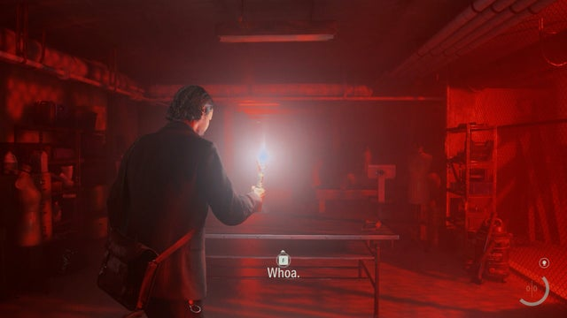
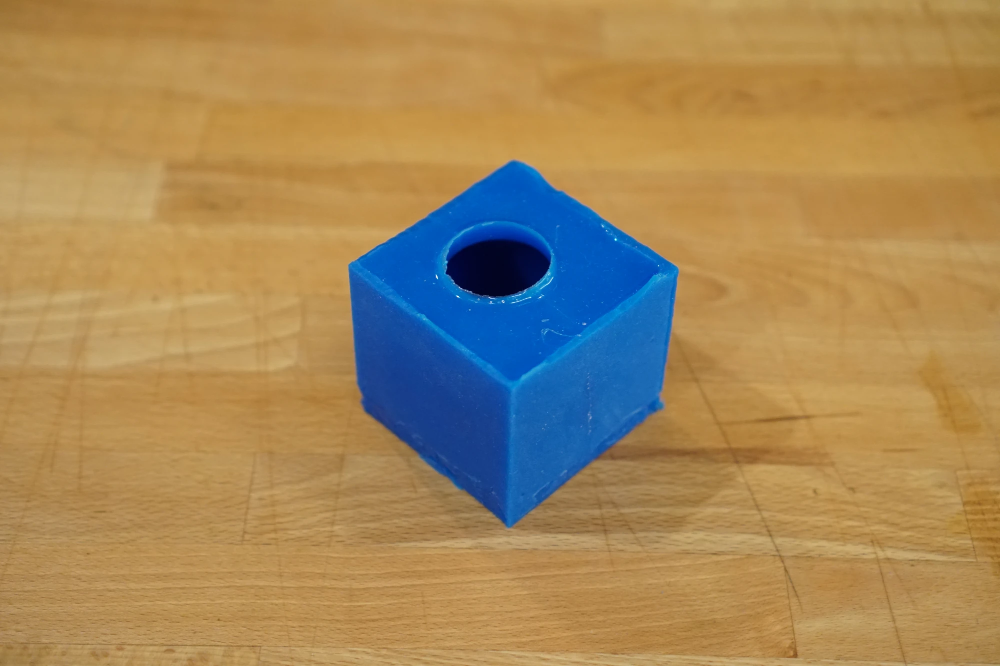

If you know much of anything about me, you'll know I **love** [Alan Wake](https://www.alanwake.com/), whose story centers around a writer trapped in a nightmare realm where fiction becomes reality. It's so firmly in my favorite genre of [New Weird](https://tvtropes.org/pmwiki/pmwiki.php/Main/NewWeird) that it feels like targeted content! Thankfully, I've roped [Maggie May](https://marms.art) into my obsession, and for this year's [MomoCon](https://www.momocon.com/) Maggie pulled off a *fantastic* Alan Wake cosplay.

A fantastic costume calls for a fantastic prop, so I set out to build Alan's guiding light through the Dark Place, the Angel Lamp:

<winter-carousel>
    
    
    
</winter-carousel>

## Preparing

When making *any* prop, it's important to collect some image and video references of what you're trying to make. Official sources are *great*, but it's often useful to look at non-official things like fan art and other cosplays.

<winter-carousel>
    
    
    
    
    
    
    
</winter-carousel>

It's also important to do research, as a little research can save so much time. Maggie found [a very high-quality 3D model][3d-model] of the Angel Lamp that saved us the time and effort of creating our own or modifying an existing lamp.

{.medium}

With references and research in mind, it's time to come up with a plan. Going into this project, my rough plan was:

1. 3D print the lamp pieces and assemble them
2. Post-process (sand/smooth) the lamp
3. Prime and paint the lamp with metallic paint
4. ???
5. Success

Clearly I didn't have it all figured out at the start. I would eventually have to figure out how to weather the lamp, how to make the bulb, and how I wanted to make the light work. There were just too many unknowns, so I wanted to wait until I had something physically in my hands before working out those details. A plan is important, but even more important is not to overplan!

[3d-model]: https://cults3d.com/en/3d-model/home/angel-lamp-alan-wake-2-krotek-inc

## 3D printing

3D printers are unfortunately not magic, so it takes a fair amount of consideration to successfully print something like this. Since I wanted to do a lot of post-processing to make the lamp *look* the part, I needed to pick a suitable material. In this case, that's [ABS]. ABS has a lot of advantages for this case, including good strength and durability but also that fact that it sands, smooths, and holds paint extremely well.

{.small}

Source: [Polymaker](https://us.polymaker.com/products/polylite-abs)
{.image-caption}

However, ABS isn't all roses! It's notoriously difficult to print due to the fact that it loves to shrink and warp and it gives off some gross fumes. These issues are even more present when printing a relatively large item like the lamp. Luckily, I have a ace up my sleeve - my [custom Voron 2.4 printer][voron]. This printer is an ABS printing beast, as it has a fully enclosed print chamber with a heater and a carbon filter, allowing it to vastly reduce ABS's warping and keep the workshop's air free of fumes.

There are other printers that work extremely well for printing ABS and similar materials, such as the [Bambu P1S][bambu] andd [RatRig V-Core][ratrig], so you don't need to build a printer from scratch like me!

With the material and the printer sorted, the only part left is slicing and printing. Getting the slicing settings just right is key to making the most of your printer and the material you're working with. I use [PrusaSlicer] and made careful use of [organic supports] and gyroid infill for a good balance of strength and weight.

All that's left is the actual printing! As it turns out, my first print failed due to the gcode file not uploading correctly, which was sad because it was *so* close to being done. That's alright, though, as it gave me a chance to tweak some settings and try again. The rest of the printing went off without a hitch.

For the curious, here's some stats about the prints:

- Material: [eSun ABS+ in black](https://www.esun3d.com/abs-pro-product/)
- Nozzle: [0.6mm TriangleLab ZS Nozzle](https://trianglelab.net/products/m6-zs-nozzle-hardened-steel-copper-alloy?VariantsId=11529)
- Hotend: [TriangleLab Dragon 2.0 High Flow](https://trianglelab.net/products/dragon-hotend?VariantsId=11396)
- Extruder: [Voron Stealthburner with Clockwork 2](https://github.com/VoronDesign/Voron-Stealthburner)
- Buildplate: [ULTISTIK textured, powder coated PEI sheet](https://a.co/d/11TGSGH) with [glue stick](https://a.co/d/h15dwCd)
- Slicer: [PrusaSlicer]
- Layer height: `0.2mm`
- Infill: 20% [Gyroid](https://help.prusa3d.com/article/infill-patterns_177130)
- External perimeters: 3
- Supports: [Organic supports] with painted support enforcers
- Perimeter generator: [Arachne](https://help.prusa3d.com/article/arachne-perimeter-generator_352769)
- Temperatures: `250℃` hotend, `112℃` buildplate, and `60℃` chamber

[ABS]: https://reprap.org/wiki/ABS
[voron]: https://vorondesign.com/
[bambu]: https://bambulab.com/en-us/p1
[ratrig]: https://ratrig.com/3d-printers/vcore4-configurable.html
[PrusaSlicer]: https://help.prusa3d.com/article/general-info_1910
[organic supports]: https://help.prusa3d.com/article/organic-supports_480131

## Post processing

With all the lamp pieces printed, I needed to assemble them and start preparing them for painting.

The first step is to put all the parts together, and while you can use common adhesives like superglue, I chose to [chemically weld](acetone-welding) the parts together using acetone. This method is extremely effective because it literally melts the ABS together, however, please keep in mind that working with acetone can be very dangerous so **please** take [proper precautions](acetone-precautions) if you go this route.

Next up was smoothing things out a little bit. There's a bunch of different ways you can approach this, but one of the nice things about ABS is that you can take advantage of [acetone smoothing]. Just like with welding, the basic idea is that since that acetone melts ABS it can be used to smooth and remove layer lines. There's a few approaches including putting the print in a big container and using acetone vapor to evenly smooth the entire item (theoretically), but in this case I just used a small brush to carefully brush a small amount of acetone onto areas that stood out, such as the angel's dress. Again, if you choose to do this **please** take proper precautions with acetone!

Acetone smoothed parts from a different project
{.image-caption}

I also had to break out the Dremel to clean up some of the areas of the model that were held up by support material. Support material is never perfect, and it can leave a weird texture on the underside of those areas. A quick visit with the Dremel usually cleans these up quickly.

With the chemicals and power tools put away, it's ready to prep for painting. First, the surface needs to be roughed up  a little- this might seem weird since I just spent a bunch of time smoothing everything out, but, the paint needs a rough surface to effectively bond to the print. Sandpaper and elbow grease is the go-to here, I usually use 150 grit paper and take it nice and easy. Sanding too quickly will cause heat to build up and cause the ABS to melt, which will likely ruin your sandpaper and your day.

Ready for priming
{.image-caption}

Once sanded, I blow off all the sand particles with some compressed air and take the model outside for priming. Priming is actually really important for getting good results when painting 3d prints, as it gives you another chance to tackle those pesky layer lines. Using a *filler* primer, such as [this one from Rust-oleum](rustoleum-filler-primer), can make your life so much easier. I sprayed a few coats, let it fully cure for 2 days, and then re-sanded it. The second sanding it the trick to hiding even more layer lines. After the second sanding, I gave it a final coat of primer.

After priming
{.image-caption}

[rustoleum-filler-primer]: https://www.rustoleum.com/product-catalog/consumer-brands/auto/primers/filler-primer-spray
[acetone-welding]: https://clevercreations.org/acetone-welding-abs-plastic-together/
[acetone-precautions]: https://3dprinting.stackexchange.com/a/85
[acetone smoothing]: https://artist-3d.com/how-to-smooth-3d-prints-with-acetone/

## Painting and weathering

Painting is so much fun, it's where all of your work really starts to come together. Getting a prop's shape right is only half the equation, you also gotta get the *look* right. Picking out the right paint, or combination of paints, it so critical. It's dreadfully easy to make your hard work look like injection molded garbage from Spirit Halloween's discount bin with the wrong paint. This is where your references will come in handy- take the time to compare your paint options with your references. Don't just pay attention to the color, also pay attention to the surface finish and material properties- is it metallic? wooden? plastic? is it glossy or matte? pristine or weathered?

For this lamp, we wanted it to have a fairly realistic look- we wanted it to look like antique brass. Short of [electroplating], the best way to get a metallic look is to use high-quality metallic spray paints. I went with [Montana GOLD Copperchrome][montana-gold], which is generally pretty easy to find at local arts and crafts stores (we got ours at [Sam Flax]). A few coats of this made our lamp look *spectacular*, unfortunately I failed to capture a picture of it in this state.

Source: [Montana Cans][montana-gold]
{.image-caption}

While it looks pretty right after painting, it's not *quite* the look we're going for- we wanted **antique** brass so that means weathering. I used the tried and true [Rub 'n Buff][rub-n-buff], in this case their *spanish copper* shade, and used my hands to apply it rather haphazardly. I followed that up with some watered-down black acrylic paint and a sponge to get into the tiny crevasses to simulate years of dust and dirt build up.

<winter-carousel>
    
    
</winter-carousel>

The end result is quite beautiful in my opinion, balancing the brilliant metallic paint with the dullness of aging.

[electroplating]: https://all3dp.com/1/electroplating-3d-prints-all-you-need-to-know/
[montana-gold]: https://www.montana-cans.com/Montana-GOLD-400ml-Chrome-Effect-Colors/285936
[Sam Flax]: https://samflaxatlanta.com/
[rub-n-buff]: https://shop.amaco.com/rub-n-buff-spanish-copper/

## The bulb

It's at this point that my planning came to an end and I needed to cook up a strategy to create the bulb for the lamp. The bulb is not a standard lightbulb size or anything like that, so it was necessary to fabricate something custom. The artist included a 3d model for the bulb:

The challenge was turning that into a transparent, glass-like object that could reasonably pass as a bulb. An [SLA resin printer][resin-printer] would be ideal for this, as there's good transparent resin options and the print resolution is high enough that the layer lines wouldn't cause odd refractions that betray the glass-like appearance.

Source: [Formlabs](https://formlabs.com/blog/3d-printing-transparent-parts-techniques-for-finishing-clear-resin/)
{.image-caption}

Unfortunately, I don't have an SLA printer! There are transparent filaments for FDM printers like the ones I have, but the material properties and the layer lines cause them to look anything **but** transparent:

Source: [Yorken on Cults3D](https://cults3d.com/en/3d-model/home/lampe-shade)
{.image-caption}

So getting something right off the printer that would work wasn't going to happen, but, I could still use the printers to help make this happen. I printed the bulb's model in standard black ABS, just like the rest of the model, and then vapor smoothed the surface. This smoothed out black bulb was used to make a [silicone mold] that I could use to cast the final, clear bulb!

The silicone mold, ready for casting
{.image-caption}

But casting a light bulb is not exactly a straightforward task, as I can't just cast a solid bulb! There's a few options for casting "hollow" objects, including two-piece molds and [rotocasting], but they typically require even more equipment and setup. I ultimately went with a hacky method- I used fast curing [UV resin] and a [UV flashlight] to slowly build up the bulb inside of the mold. This resin is *very* viscous, so I'd put a very small amount of resin in, rotate the mold to get the resin to the right spot, use the flashlight to cure it, and repeat until walls of the mold were completely covered with resin. Once it was covered enough, I de-molded it and filled in any missing spots and also added another layer of resin on the inside to make it stronger.

The end result obviously isn't perfect as it's not crystal clear, but it's miles ahead of what could be done with FDM printing alone. The abberations and flaws actually fit the aesthetic of the prop, and they came in handy for obscuring the filament- more on that in the next section.

[resin-printer]: https://formlabs.com/blog/ultimate-guide-to-stereolithography-sla-3d-printing/
[silicone mold]: https://www.smooth-on.com/product-line/mold-max/
[rotocasting]: https://www.smooth-on.com/tutorials/rotocasting-resin-lightweight-impact-resistant-displays/
[UV resin]: https://a.co/d/cCuFs9v
[UV flashlight]: https://a.co/d/iSF8mDz

## The electronics

With all the physical parts ready, it's time to tackle the electronics. It's a lamp, so obviously it needs to light up! There's a ton of different options for lighting things up, but I did want this be somewhat convincing as a light bulb, so I wanted to do something akin to the "Edison" bulbs:

{.medium}

Source: [Feit Electric](https://www.feit.com/collections/decorative-bulbs/products/100-watt-equivalent-g25-bright-white-filament-led-g25100930ca-fil-3)
{.image-caption}

Luckily, you can get the LED "filaments" from these pretty easily without having to do something silly like buy a lightbulb and break it. I grabbed mine [here][led-filament].

{.medium}

Source: [Adafruit](https://www.adafruit.com/product/5509)
{.image-caption}

I used some thick wire to create a structure to hold the LED noodle in place to make it look like a filament, however, my wire sculpting skills need more work 😅. Thankfully, the bulb's abberations work in my favor and hide the ugliness underneath.

<winter-carousel>
    
    
</winter-carousel>

This little light noodle is rated for `3V` at around `200mA`, which should be easy enough to power from a portable battery. There's super limited space inside the lamp to hide the battery, so I went with [these][batteries] USB battery banks. You could also use LiPo batteries, but I really hate working with them directly so I avoid them if I can.

Battery pack
{.image-caption}

While you could wire the LEDs to the battery through a chopped up USB cable and a resistor and call it a day, I wanted **more**. I wanted the lamp to be able to flicker and behave like it does in the game:

For this, I'd need a brain! For no reason other than it being small and readily available in my stash of devboards, I used an [Adafruit Trinket M0][trinket] running [CircuitPython] as the brains:

{.medium}

Source: [Adafruit](https://www.adafruit.com/product/3500)
{.image-caption}

The last piece of the puzzle is that Trinket needs a way to control the LEDs. You could drive the LEDs directly from one of the GPIO pins, but it would be pathetically dim due to being limited by the low GPIO current (`~10mA`). There's a ton of options out there for driving LEDs, and I initially went with a simple transistor setup but found it to lacking. Luckily, I had a few [CPC1014N] solid state relays around from another project, so I wired one of them up and was greeted with a fanstic result:

<video controls>
    <source src="./angel-lamp-head-loop-lq.mp4">
</video>

These solid state relays aren't the fastest at switching, so I can't do really fine levels of brightness control but I can create really convincing flicker and dimming. If you're interested in the code, you can check it out [here][code].

The last touches were to make a small flap out of cardstock to cover the bottom of the lamp, hiding the battery and electronics, and a fake severed power cable:

<winter-carousel>
    
    
    
</winter-carousel>

[led-filament]: https://www.adafruit.com/product/5509
[batteries]: https://a.co/d/5dRQfRz
[trinket]: https://www.adafruit.com/product/3500
[CircuitPython]: https://circuitpython.org/
[code]: https://gist.github.com/theacodes/23667e827fbfa5a16d19dadb5bee19d3
[CPC1014N]: https://www.littelfuse.com/media?resourcetype=datasheets&itemid=3e4eb187-4c39-460b-979d-cfbae53b1b5d&filename=littelfuse-integrated-circuits-cpc1014n-series-datasheet

## Wrapping up

This whole build took about six days in real time, with a few of those days idle as I literally waited for paint to dry. Putting together a build like this in such a short period of time is **not** ideal! If I had a chance to do it again, I'd just give myself more time to find better methods of creating the bulb, filament, and enclosing the bottom of the lamp. That said, I am overwhelmingly proud of the result.

<winter-carousel>
    
    
    
</winter-carousel>

If you build a angel lamp or a similar prop and found this writeup useful, I'd love to hear from you and see what you've made! It brings me so much joy to see people bring stuff to life.

<link rel="stylesheet" type="text/css" href="/static/winter.css"></link>
