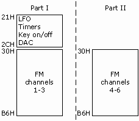
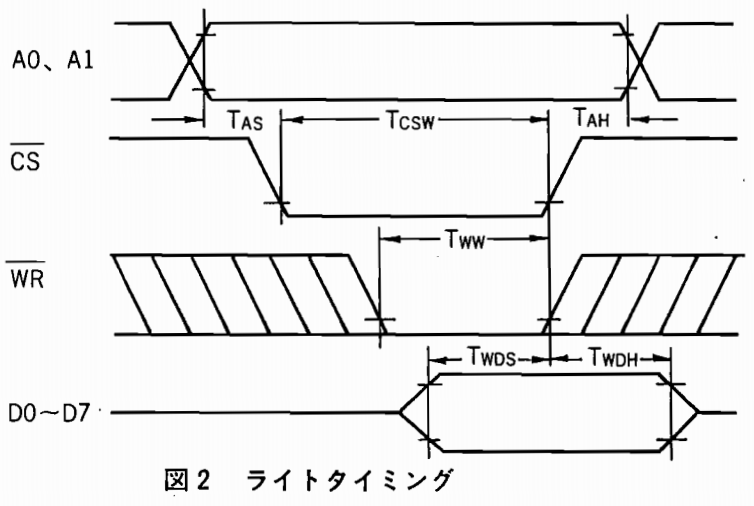

> *Catch [part 1](../genesynth-part-1-idea-and-research) if you missed it.*

Now that I had a basic idea of what I wanted to do with my Genesis-inspired synthesizer, I went about researching some parts.

## Obtaining the chips

As mentioned in the [previous post](genesynth-part-1-idea-and-research), the Genesis used two sound chips: a [Yamaha YM2612](https://en.wikipedia.org/wiki/Yamaha_YM2612) for FM synthesis and a [Texas Instruments SN76489 PSG](https://en.wikipedia.org/wiki/Texas_Instruments_SN76489) for square waves.

Neither of these chips are produced anymore, so really the only option for obtaining these easily is via Ebay. There's several sellers of these chips, which are presumably harvested from consoles, computers, and other digital junk. I was able to obtain them for around $3/each which is honestly really affordable. I bought several just in case one was bad or I managed to fry one (spoiler: I did).

I've also heard [rumors of a vending machine in Japan where you can just buy these](https://twitter.com/glowascii/status/1008716401824022528). What an absolutely magical place.

## Talking to the chips

Here's the hard part: actually communicating with these chips. This part is *hard* and in fact I still haven't quite gotten this right.

The YM2612 can somewhat be treated as sort of a RAM chip. A very temperamental RAM chip. It basically has a large number of "registers" exposed as a memory map. These registers control everything from the notes being played to the FM parameters. You write data to these registers using an 8-bit bus by first writing the register address then writing the register value.



(You can read more about the memory map over at [Maxim's World of Stuff](http://www.smspower.org/maxim/Documents/YM2612))

The timing here is really tricky. The YM2612 will actually see the write relatively quick. Take a look at the write timing diagram from the [manual](/files/YM3438_APL.pdf):



However, the chip will not finish *processing* the write for several internal cycles. The number of cycles actually depends on which register you changed. Some folks on forums have done a little research and determined that there is a safe minimum that will cover you so that's what I've tried to do so far.

The code for writing to the YM2612 looks a little like this:

```c++
void set_reg(uint8_t address, uint8_t data, int port) {
  // Write the register address first.
  digitalWriteFast(YM_A1, port);
  digitalWriteFast(YM_A0, LOW);
  set_data_lines(address);
  // technically we should give *some* time between setting the bytes and
  // pulling the pins, but it seems to work fine without that.
  digitalWriteFast(YM_CS, LOW);
  digitalWriteFast(YM_WR, LOW);
  // We shouldn't raise the WR and CS until at least YM_WRITE_WAIT have passed.
  delay10ns(YM_WRITE_WAIT);
  digitalWriteFast(YM_WR, HIGH);
  digitalWriteFast(YM_CS, HIGH);
  // We must wait for the chip to finish reading our data before loading in the
  // next byte.
  delay10ns(YM_DATA_WAIT);

  // Same as above, but with A0 high to write the register data.
  digitalWriteFast(YM_A0, HIGH);
  set_data_lines(data);
  digitalWriteFast(YM_CS, LOW);
  digitalWriteFast(YM_WR, LOW);
  delay10ns(YM_WRITE_WAIT);
  digitalWriteFast(YM_WR, HIGH);
  digitalWriteFast(YM_CS, HIGH);
  delay10ns(YM_DATA_WAIT);
}
```

With a basic write command, I was ready to start experimenting with the hardware.

## Proof of concept using Arduino

I decided to start with a microcontroller I had on hand and didn't mind if I ruined: an Arduino Uno. I wired up the data bus and control lines between the Ardiuno and YM2612 and setup the Ardiuno to output the 8Mhz clock needed by the YM2612 as well.

I was able to get a simple [test patch](http://www.smspower.org/maxim/Documents/YM2612#testprogram) working with a *lot* of trial and error with the timing, but I wasn't quite ready to go full-on with MIDI because there was just so much about the hardware interface I needed to figure out.

I decided to try a really simple [VGM](http://vgmrips.net/wiki/VGM_Specification) to playback on the Arduino to test the chip interface. Since the Uno has really limited memory and I didn't have any SD sheilds around, I wrote a really dumb Python script to convert a VGM into [C code](https://gist.github.com/theacodes/7e98e4d6e7337e451bf0213ea2086458) so I could just compile it in - basically a static VGM player. This allowed me to get a very short, very simple VGM playing. In retrospect - this was dumb, I should've just waited for a better microcontroller and did a real VGM player.

<blockquote class="twitter-tweet" data-lang="en"><p lang="en" dir="ltr">Why yes, this *IS* and Arduino playing the Sonic continue theme using the actual sound chip from a Sega Genesis. <a href="https://t.co/H5VhOVR3Np">pic.twitter.com/H5VhOVR3Np</a></p>&mdash; Magic &amp; Technology in a Kiss (@theavalkyrie) <a href="https://twitter.com/theavalkyrie/status/1004228922060386305?ref_src=twsrc%5Etfw">June 6, 2018</a></blockquote>
<script async src="https://platform.twitter.com/widgets.js" charset="utf-8"></script>

I consider this to be a pretty successful proof of concept. It was enough for me to continue researching and buy more hardware to make this happen.

## Stepping up the hardware with Teensy

I decided to use a [Teensy 3.5](https://www.pjrc.com/store/teensy35.html) for my microcontroller. I'd seen others use this chip to interact with old school sound chips and it's got several features that are *super* useful in this context: SD card, 5v tolerant, very fast, large program space, and an incredibly huge amount of I/O.

I transferred my circuit over the the Teensy. After dealing with some more [timing issues](https://twitter.com/theavalkyrie/status/1004979142494859264), and fixing up the audio output a little, I managed to get a [VGM parser and player](https://github.com/theacodes/genesynth/blob/master/vgm.cpp) working.

<blockquote class="twitter-tweet" data-lang="en"><p lang="en" dir="ltr">PROGRESS!<br><br>My amp still has some weird low frequency noise that I can&#39;t figure out but it works! <a href="https://t.co/etBmsGoM2A">pic.twitter.com/etBmsGoM2A</a></p>&mdash; Magic &amp; Technology in a Kiss (@theavalkyrie) <a href="https://twitter.com/theavalkyrie/status/1005689259091623936?ref_src=twsrc%5Etfw">June 10, 2018</a></blockquote>
<script async src="https://platform.twitter.com/widgets.js" charset="utf-8"></script>

## Next time

In the next post, I'll cover creating a proper audio amplifier for the chip as well as getting the SN76489 hooked up. See you then. :)
