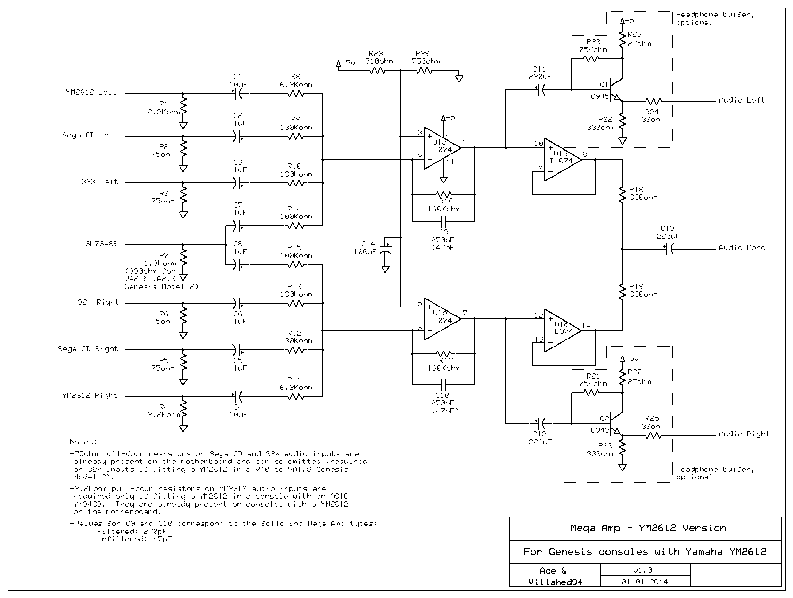

> *Catch [part 1](../genesynth-part-1-idea-and-research) and [part 2](../genesynth-part-2-basic-communication) if you missed them.*

In the previous posts I managed to get microcontroller ([Teensy 3.5](https://www.pjrc.com/store/teensy35.html)) talking the YM2612 and making some sounds. The next step is to get the audio output out of the YM2612 into a proper audio (pre)amplifier.

Having the microcontroller work as a [VGM](http://vgmrips.net/wiki/VGM_File_Format) player is super advantageous at this stage. A VGM player is [relatively straightforward to implement](https://github.com/theacodes/genesynth/blob/da421870a016c0b16930cb417286ae8897aa3778/vgm.cpp) and plays music without any human intervention. This frees me up to focus on just making the audio output work without having to implement the entire MIDI functionality.

## Why is this necessary?

The YM2612 directly outputs an audio signal but it's not appropriate to use as [line-level audio](https://en.wikipedia.org/wiki/Line_level) as-is. The YM2612 can't *drive* very much current out of its output pins so trying to use it directly will lead to overheating and damaging the chip (it might work for a few minutes, but you're playing with fire). A minimum, you'll need an active buffer between the chip and output to protect it. A buffer is a good start, but it also needs to be *amplified* a bit to get up to line level. Finally, since I want mono output here I need to combine the left and right audio signals.

## Research

I wanted the Genesynth to closely match the sound of the original Genesis. I did some research and found some excellent material in the Genesis modding community, specifically the MegaAmp mod.

MegaAmp uses a TL074 Quad Op-Amp configured first as an [active mixer/summing amplifier](http://sound.whsites.net/articles/audio-mixing.htm#s3) to combine the YM2612 and SN76489 signals and then as [a buffer](https://en.wikipedia.org/wiki/Buffer_amplifier#Op-amp_implementation) to drive the final audio output. It also has capacitor values for filtering the same frequencies as the original Genesis. This is exactly what I'm looking for.

## Prototyping

I built the MegaAmp circuit on a protoboard and wired it up to my prototype:

<blockquote class="twitter-tweet" data-lang="en">
I know that I said I was finally going to do midi next, but! two wonderful things happened:  1. The PSG (SN76489) came from China early! 2. The components for the new audio circuit (red board) showed up early!  So now it sounds SO GOOD. <a href="https://t.co/m7K2ktYxIT">https://t.co/m7K2ktYxIT</a> <a href="https://t.co/KFPT7A6WLr">pic.twitter.com/KFPT7A6WLr</a>
&mdash; Make a Witch Foundation (@theavalkyrie) <a href="https://twitter.com/theavalkyrie/status/1008161619858190336?ref_src=twsrc%5Etfw">June 17, 2018</a></blockquote>

The result was quite nice!

<iframe width="100%" height="300" scrolling="no" frameborder="no" allow="autoplay" src="https://w.soundcloud.com/player/?url=https%3A//api.soundcloud.com/tracks/459400611%3Fsecret_token%3Ds-XFyIK&color=%237000ff&auto_play=false&hide_related=false&show_comments=true&show_user=true&show_reposts=false&show_teaser=true&visual=true"></iframe>

## Problems (& solutions)

This circuit worked great, but I started to run into the limits of my electronics knowledge. I've never really worked with analog circuits at all so when things went wrong with the circuit I mostly just ended up rebuilding it until it worked. I ended up doing a lot of research and watching a lot of videos around Op Amps to feel more confident working with this particular circuit.

The biggest problem is that the audio amplifier is *noisy*. You can hear it a bit in the recording above, but it was actually seriously obnoxious and really made it hard for me to believe that I was doing things correctly here. I did a lot of research on this as well, looking at everything from split ground planes to inductors. This problem actually prompted me to do something I hadn't planned to do - build a printed circuit board (PCB) for this synthesizer. I *did* eventually solve this issue and got crystal clear audio using this circuit. I'll cover that in another post.

## Next steps

In the next post, I'll talk about moving the circuit to a protoboard and some of the first steps with MIDI. In a later post, I'll talk about designing PCBs.
