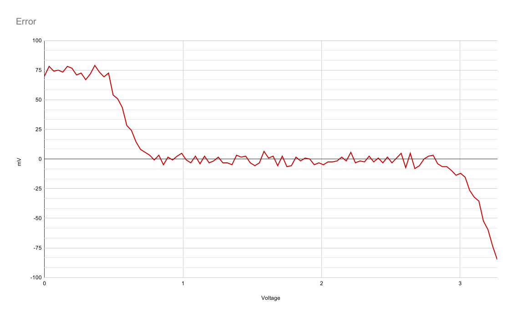
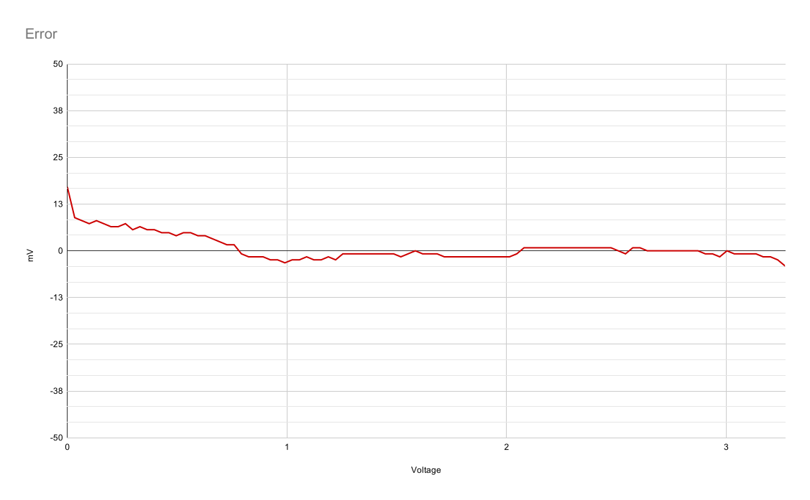
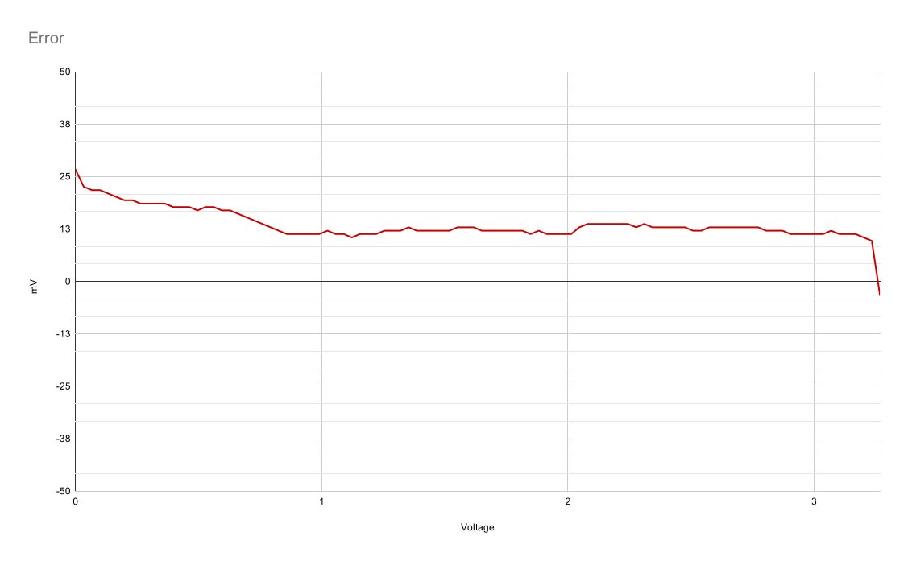
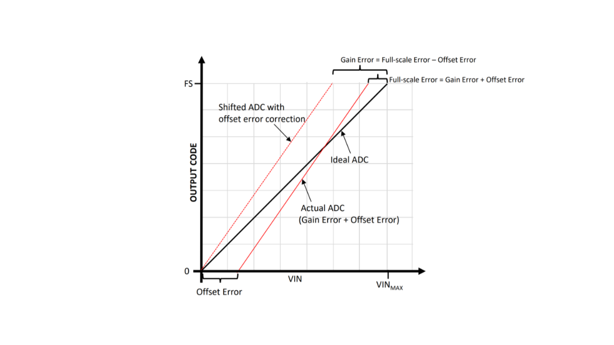
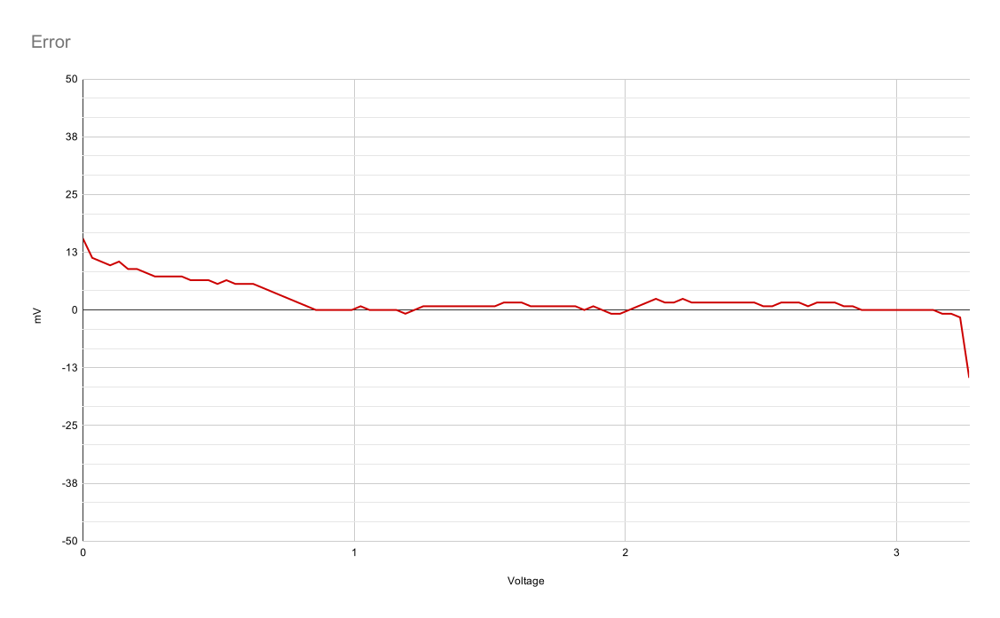

<link rel="stylesheet" href="https://unpkg.com/purecss@2.0.3/build/forms-min.css" />


In my [previous blog post](../reading-analog-values-with-the-samd-adc), I walked through how to do a basic analog read using the SAM D21's Analog to Digital converter (ADC). While this simple setup can work for a lot of cases, it's not uncommon to want to get better performance or accuracy out of the ADC.

This post explores the various configuration options for the ADC and how it impacts speed and accuracy. Since the SAM D family has similar ADC peripherials across the line this information is likely applicable to all of them. Additionally, the techniques and ideas here are generally applicable to all ADCs.

One more thing before I get started - this is just what I've gathered from the datasheets, application notes, code examples, and observation on real hardware. I could be totally wrong about some of these things! I'll try to make a note when there's something I'm not sure of - and if you know the answer don't hestitate to [reach out to me](https://thea.codes).

## A handy dandy calculator

There's several configuration options for the SAM D21 ADC. Some of them impact speed, some impact accuracy, and some impact both. I created this calculator to show how the various registers impact the ADC. This is a *super* handy tool for tuning the ADC for your particular use case and takes a lot of the guess work out of it. It's what I wish I had when I first started with the SAM D21.

**Important note**: This calculator is only valid for *single ended, one-shot measurements*. On the whole, differential measurements and free-running mode take slightly less time. You can read more details about their timing in [Section 33.6.5.1 of the datasheet][datasheet].

<div id="conversion-time-calculator">
    <form class="pure-form  pure-form-stacked">
        <legend of="zelda">Conversion time calculator</legend>
        <fieldset>
            <label for="glck">GCLK frequency (including GCLK division)</label>
            <input name="glck" type="number" value="48" min="0" max="48"></input>
            <span class="pure-form-message">MHz</span>
            <label for="glck_div">ADC clock prescaler</label>
            <select name="glck_div">
                <option value="4">DIV4</option>
                <option value="8">DIV8</option>
                <option value="16">DIV16</option>
                <option value="32">DIV32</option>
                <option value="64">DIV64</option>
                <option value="128">DIV128</option>
                <option value="256">DIV256</option>
                <option value="512" selected>DIV512</option>
            </select>
            <span class="pure-form-message"><code>ADC->CTRLB.PRESCALER</code></span
            <label for="resolution">Resolution</label>
            <select name="resolution">
                <option value="12">12</option>
                <option value="10">10</option>
                <option value="8">8</option>
            </select>
            <span class="pure-form-message"><code>ADC->CTRLB->RESSEL</code></span>
            <label for="gain">Gain</label>
            <select name="gain">
                <option value="1">1X</option>
                <option value="1.5">2X</option>
                <option value="2">4X</option>
                <option value="2.5">8X</option>
                <option value="3">16X</option>
                <option value="1.5" selected>DIV2</option>
            </select>
            <span class="pure-form-message"><code>ADC->INPUTCTRL.GAIN</code></span>
            <label for="samplen">Sample time length</lable>
            <input name="samplen" type="number" value="0" min="0" max="63"></input>
            <span class="pure-form-message"><code>ADC->SAMPCTRL.SAMPLEN</code></span>
            <label for="samplenum">Number of samples</lable>
            <select name="samplenum">
                <option value="1" select>1</option>
                <option value="2">2</option>
                <option value="4">4</option>
                <option value="8">8</option>
                <option value="16">16</option>
                <option value="32">32</option>
                <option value="64">64</option>
                <option value="128">128</option>
                <option value="256">256</option>
                <option value="512">512</option>
                <option value="1024">1024</option>
            </select>
            <span class="pure-form-message"><code>ADC->AVGCTRL.SAMPLENUM</code></span>
            <label for="correction">Offset correction</label>
            <select name="correction">
                <option value="0" selected>No</option>
                <option value="1">Yes</option>
            </select>
            <span class="pure-form-message"><code>ADC->CTRLB.CORREN</code></span><label for="adc_clock">ADC clock</label>
            <input name="adc_clock" type="text" value="" readonly></input>
            <span class="pure-form-message">kHz</span>
            <span class="pure-form-message" id="clock-warning" class="form-warning">Clock speed is over the maximum of 2,100kHz!</span>
            <label for="sample_time">Sample time</label>
            <input name="sample_time" type="text" value="" readonly></input>
            <span class="pure-form-message">microseconds</span>
            <label for="prop_delay">Propagation delay</label>
            <input name="prop_delay" type="text" value="" readonly></input>
            <span class="pure-form-message">microseconds</span>
            <label for="conversion_time">Conversion time</label>
            <input name="conversion_time" type="text" value="" readonly></input>
            <span class="pure-form-message">microseconds</span>
            <label for="impedance">Max input impedance</label>
            <input name="impedance" type="text" value="" readonly></input>
            <span class="pure-form-message">kΩ</span>
        </fieldset>
    </form>
</div>
<script>
(function() {
    const form = document.querySelector("#conversion-time-calculator");
    let calc = function(){
        let glck = parseFloat(form.querySelector("[name=glck]").value);
        let glck_div = parseFloat(form.querySelector("[name=glck_div]").value);
        let resolution = parseFloat(form.querySelector("[name=resolution]").value);
        let gain_delay = parseFloat(form.querySelector("[name=gain]").value);
        let samplen = parseFloat(form.querySelector("[name=samplen]").value);
        let samplenum = parseFloat(form.querySelector("[name=samplenum]").value);
        let correction = parseFloat(form.querySelector("[name=correction]").value);
        let adc_clock = (glck * 1000000 / glck_div);
        let prop_delay = (1 + resolution / 2 + gain_delay) / adc_clock;
        let sample_time = (samplen + 1) * (1 / adc_clock / 2);
        let total_sample_time = samplenum * sample_time;
        let min_sample_time = (1 / adc_clock / 2);
        let correction_time = correction * (1 / adc_clock) * 13;
        let conversion_time = correction_time + total_sample_time + prop_delay - min_sample_time;
        let impedance = sample_time / (3.5e-12 * 9.02) - 3.5e3;
        form.querySelector("#clock-warning").style.display = adc_clock <= 2100000 ? "none" : "block";
        form.querySelector("input[name=adc_clock]").value = (adc_clock * 10e-4).toLocaleString(undefined, {maximumFactionDigits: 3});
        form.querySelector("input[name=sample_time]").value = (total_sample_time * 10e5).toLocaleString(undefined, {maximumFractionDigits:2});
        form.querySelector("input[name=prop_delay]").value = (prop_delay * 10e5).toLocaleString(undefined, {maximumFractionDigits:2});
        form.querySelector("input[name=conversion_time]").value = (conversion_time * 10e5).toLocaleString(undefined, {maximumFractionDigits:2});
        form.querySelector("input[name=impedance]").value = impedance.toLocaleString(undefined, {maximumFractionDigits:0});
    };
    form.addEventListener("change", calc);
    calc();
})();
</script>

The most important numbers to note here are the **conversion time** and the **max input impedance**. The conversion time is the overall time it takes to perform the conversion - this takes into account the clock, sample time, and propagation delay (it's not a simple sum, unfortunately). The impedance is our first topic for tuning.

## Input impedance

The ADC on the SAM D21 makes measurements by charging a capacitor to the input voltage. In order for measurements to be accurate the capacitor must have enough time to charge up to the input voltage before sampling occurs. How long this takes depends on the input [impedance](https://en.wikipedia.org/wiki/Electrical_impedance). If you assume that you're measuring DC voltage then impedance is the same as resistance. So you just have to think about all of the resistance between the voltage you're trying to measure and the ADC input pin.

For example, for this circuit:


The input impedance is 250kΩ (100kΩ + 150kΩ). When connecting this circuit to the ADC you have to ensure that the ADC is configured so that it has enough time to fully charge that capacitor with that amount of input impedance. The way this is done is by changing the sample time, `ADC->SAMPCTRL.SAMPLEN`. Increasing the sample time gives the capacitor a longer amount of time to charge and thus increasing the amount of input impedance the ADC can deal with. It also slightly increases the overall conversion time. Try using the calculator above to get the ADC to work with the 250kΩ impedance shown in the example above (spoilers: you only have to increase the sample time by 1).

Here's the code for changing the sample time. You should do this before enabling the ADC:

```c
// Set the sample time length to accommodate for input impedance.
ADC->SAMPCTRL.reg = ADC_SAMPCTRL_SAMPLEN(1);
```

You'll run into input impedance a lot. For example, if you have a potentiometer configured as a [voltage divider](https://learn.sparkfun.com/tutorials/voltage-dividers/all#applications) to provide a simple knob input for your project then the ADC's max input impedance must be greater than the whole potentiometer's resistance divided by four.

This illustrates why: when the potentiometer is close to the end, to the ADC it "looks like" a very low-value resistor to one end in parallel to the rest of the  potentiometer to the other end. When two very different resistors are in parallel, the overall resistance is close to the smaller value. The impedance is largest at the midpoint: Here both halves are half of the potentiometer's value and the overall impedance is going to be half of that because both are in parallel.


If you have a use case where you *don't* want to increase the sample time for the ADC, you can use a [buffer](https://en.wikipedia.org/wiki/Buffer_amplifier) to change the source impedance, like in this circuit that provides a source impedance of just 1kΩ:


For more details on how the calcuator figures out the max input impedance and how the capacitor charging works see [section 37.11.4.3 of the datasheet][datasheet].

## Baseline

Alright, now that you've got the ADC configured with the proper input impedance you can get a sense for the baseline accuracy of the measurements. ADCs have a couple of real-world properties that impact accuracy. These are generally presented by the manufacturer as a range of [Integral Nonlinearity](https://en.wikipedia.org/wiki/Integral_nonlinearity) and [Differential Nonlinearity](https://en.wikipedia.org/wiki/Differential_nonlinearity). Those scary words basically just boil down to "how does the ADC's *actual* measurements compare to what I *expect* the measurements to be?" For example, if you give the ADC `1.0v` and it measures `1.1v` that's some of that non-linearity showing through.

Before tweaking the ADC settings to get better accuracy it's important to understand what the *current* accuracy looks like. For my tests, I used a precision voltage source (a calibrated 16-bit digital to analog converter) and measured 100 data points across the input voltage range of the ADC. I then compared the measured values against the expected values to determine the amount of error.

Here's two images that show the real-world performance of the SAM D21 ADC with minimal configuration - the same configuration used in my previous blog post and similar to the configuration you'll see by default in Arduino: 12 bit, one sample, no offset or gain correction.

Here's the measured results compared against the expected values:


And here's that same data but represented as the amount that each measurement was off from the expected measurement:



While this isn't entirely awful there is still lots of room for improvement! The next few sections will discuss techniques for improving the ADC's accuracy.

By the way, if you want some more information on all the different real world properties of ADCs and DACs and how those affect accuracy, check out this [application note from TI on data converters][SLAA013].


## Multisampling and averaging

You can improve the SAM D21 ADC accuracy by taking multiple samples for a measurement and then averaging them. Luckily, the hardware can do this for you. However, since multisampling and averaging cause each measurement to take a longer amount of time you'll need to balance speed and accuracy for your use case. If you're measuring something that doesn't need to be sampled at very high rate using more multisampling and averaging is a good idea. The general rule of thumb is to use as much as you can while still sampling fast enough to meet your requirements.

I'm going to show you how multisampling and averaging can impact accuracy. The SAM D21 can be configured to average `1` to `1024` samples in steps of powers of two. For the first test I set the number of samples to average to `64`. Here's the results:



This is already a huge improvement over the baseline. Note that I also reduced the scale of the graph. The time cost for doing 64 samples isn't too much of a hit on performance, either.

Here's the code for configuring multisampling and averaging. Again, do this before enabling the ADC.

```c
// Configure multisampling and averaging.
// Note that ADJRES must be set according to table
// 33-3 in the datasheet.
ADC->AVGCTRL.reg = ADC_AVGCTRL_SAMPLENUM_256 | ADC_AVGCTRL_ADJRES(4);

// For multisampling to work correctly the RESSEL part
// of CTRLB must be set to 16-bit, even if you're doing
// 12-bit measurements. See section 33.6.7  in the
// datasheet.
ADC->CTRLB.reg |= ADC_CTRLB_RESSEL_16BIT;
```

Okay, so `64` samples looks better, but what if you use even more samples? How much does that improve things?

Well here's at `256` samples:



And at `1024` samples:


For higher sample rates the error curve tends to flatten out - indicating that the ADC is exhibiting a more linear transfer function - which is a good thing. However, notice that the curve as a whole has migrated upwards a bit. From what I can gather this is due to *offset error* accumulating, and offset error is the topic of the next section.


## Offset & gain error correction

Okay, so you've determined how much multisampling you want to use for your application, however, things aren't quite perfect. If you're like me and decided to go with `256` samples you now have an offset on all of your measurements. You could just update your firmware to subtract the offset from each measurement but the hardware can actually do this *and a little more* for you.

The SAM D21 has the ability to apply both *offset* and *gain error* correction. *Offset error* is pretty easy to intuit from what you've experienced so far and the graphs above - it's a constant amount of error on each measurement. The *gain error* is a bit more subtle. It's the difference between the measured value and the expected value at the top of the ADC's range - that is, it's deviation from the *slope* of the ideal transfer function. This picture illustrates this:



<div class="image-caption"><em>Source: Microchip Application Note TB3185</em></div>

When looking at the error graphs of real-world measurements in previous sections the gain error can be see as a "tilt" in the error line. Ideally, the line of best fit in that chart would be straight across.

Okay, enough theory. How do you address the gain and offset errors? The SAM D21 has two registers, `ADC->OFFSETCORR` and `ADC->GAINCORR`, for configuring the hardware to do the correction for you. The hardware will automatically apply the formula `result = (conversion_value - OFFSETCORR) * GAINCORR`. This is detailed in [section 33.6.10 of the datasheet][datasheet]. The datasheet doesn't give a lot of hints on figuring out these values, unfortunately.

The best way I've found for calculating these values is to take two measurements: one in the bottom quarter of the ADC's range (say, at 15%) and one at the top quarter of the ADC's range (say, at 85%). This is from the [TB3185 Application Note][TB3185]. Once you have these two measurements you can determine the gain and offset error using these formulas:

```python
low_expected = ...
low_measured = ...
high_expected = ...
high_measured = ...

gain_error = (high_measured - low_measured) / (high_expected - low_expected)
offset_error = low_measured - (gain_error * low_expected)
```

The gain error is a positive or negative integer that defines a constant value that's applied to every measurement. The gain error is a fractional number that is multiplied by every measurement after offset adjustments are applied. When setting the registers it's important to note that `OFFSETCORR` is in [two's complement](https://en.wikipedia.org/wiki/Two%27s_complement) and `GAINCORR` is expressed as an integer that's `2048 / gain correction`. Here's an example of setting the registers:

```c
// Offset error is a 12-bit integer in two's complement format.
int16_t offset_error = ...
// Gain error is a 12-bit integer that's expressed at 2048 / measured gain error.
int16_t gain_error = 2048 / ...;

ADC->OFFSETCORR.reg = ADC_OFFSETCORR_OFFSETCORR(offset_error);
ADC->GAINCORR.reg = ADC_GAINCORR_GAINCORR(gain_error);

ADC->CTRLB.bit.CORREN = true;
```

Of course, this is a lot of math to deal with and values to juggle. To make things a little easier for you I made another handy calculator:

<div id="error-calculator">
    <form class="pure-form  pure-form-stacked">
        <legend of="zelda">Gain and offset error calculator</legend>
        <fieldset>
            <label for="in-voltage">Max input voltage</label>
            <input name="in-voltage" type="number" value="3.3" min="0" max="3.3"></input>
            <span class="pure-form-message">Volts</span>
            <label for="low-voltage">Low side input voltage</label>
            <input name="low-voltage" type="number" value="1.0" min="0" max="3.3"></input>
            <span class="pure-form-message">Volts</span>
            <label for="low-measured">Low side measured ADC code</label>
            <input name="low-measured" type="number" value="1241" min="0" max="4096"></input>
            <span class="pure-form-message">0 - 4096</span>
            <label for="high-voltage">High side input voltage</label>
            <input name="high-voltage" type="number" value="3.0" min="0" max="3.3"></input>
            <span class="pure-form-message">Volts</span>
            <label for="high-measured">High side side measured ADC code</label>
            <input name="high-measured" type="number" value="3724" min="0" max="4096"></input>
            <span class="pure-form-message">0 - 4096</span>
            <label for="offset-error">Offset error & <code>ADC->ERRORCORR</code></label>
            <input name="offset-error" type="text" value="" readonly></input>
            <span class="pure-form-message"></span>
            <label for="gain-error">Gain error</label>
            <input name="gain-error" type="text" value="" readonly></input>
            <span class="pure-form-message"></span>
            <label for="gain-error-reg"><code>ADC->GAINCORR</code></label>
            <input name="gain-error-reg" type="text" value="" readonly></input>
            <span class="pure-form-message"></span>
        </fieldset>
    </form>
</div>
<script>
(function() {
    const form = document.querySelector("#error-calculator");
    let calc = function(){
        let in_voltage = parseFloat(form.querySelector("[name=in-voltage]").value);
        let high_voltage = parseFloat(form.querySelector("[name=high-voltage]").value);
        let low_voltage = parseFloat(form.querySelector("[name=low-voltage]").value);
        let low_measured = parseFloat(form.querySelector("[name=low-measured]").value);
        let high_measured = parseFloat(form.querySelector("[name=high-measured]").value);
        let low_expected = Math.round(low_voltage / in_voltage * 4096);
        let high_expected = Math.round(high_voltage / in_voltage * 4096);
        let gain_error = (high_measured - low_measured) / (high_expected - low_expected);
        let offset_error = Math.round(low_measured - (gain_error * low_expected));
        let gain_error_reg = Math.round(2048 / gain_error);
        form.querySelector("input[name=gain-error]").value = gain_error.toLocaleString(undefined, {maximumFactionDigits: 3});
        form.querySelector("input[name=gain-error-reg]").value = gain_error_reg;
        form.querySelector("input[name=offset-error]").value = offset_error;
    };
    form.addEventListener("change", calc);
    calc();
})();
</script>


Wonderful. With the gain and offset correction enabled the 12-bit, 256 sample measurement is now a lot closer to reality:




## Above and beyond

After multisampling, averaging, and gain and offset correction the ADC measurements are quite good. This is certainly more than enough accuracy for most applications. But what about other applications that need a bit more accuracy? Well, there's a few more approaches that can be taken. You could borrow an approach used in [sensor linearization][sensor_linearization] and apply a [lookup table](https://en.wikipedia.org/wiki/Lookup_table) with [linear interpolation](https://en.wikipedia.org/wiki/Linear_interpolation) to further correct the measurements.

In this case the lookup table stores *calibration values* - basically, the same data that I've been using to create the charts above. It's a map of the measured value and the expected value across multiple points (*setpoints*) in the ADC's range. It doesn't take too many setpoints to accomplish good results - even just 10 setpoints can make a major difference.

With the calibration values you can use linear interpolation to adjust new measurements to correct for errors. The basic idea is to figure out which two setpoints the new measurement is between and then interpolate between the two setpoints to determine the adjust value. Hopefully this illustration is illuminating:


<div class="image-caption"><em>The measured value is adjusted according to the setpoints that it's in between. The top values for each setpoint are the measured ADC codes, the bottom values are the expected codes.</em></div>

I used this technique with the datasets above and was able to achieve excellent results with the SAM D21 ADC:


Of course, this technique takes more CPU time since you have to do calculations using the CPU for every measurement. However, for some applications this is a good tradeoff.


## Wrap up & resources

Alright! This article was a bit long but I hope it has provided some useful insight into getting the most out of your ADC. Below is a list of resources I used when researching this post and some links for further reading.

- [SAM D21 Datasheet][datasheet]
- [Understanding electrical impedance](https://www.autodesk.com/products/eagle/blog/what-is-electrical-impedance/)
- [Application Note TB3185: ADC Gain and Offset Error Calibration on ARM® Cortex®-M0+ Based MCUs][TB3185]
- [Application Note SLAA013: Understanding Data Converters][SLAA013]
- [Optimized Sensor Linearization for Thermocouple][sensor_linearization]
- [Example lookup table & linear interpolation code](https://stackoverflow.com/a/7091791)

[datasheet]: http://ww1.microchip.com/downloads/en/DeviceDoc/SAM_D21_DA1_Family_DataSheet_DS40001882F.pdf
[TB3185]: http://ww1.microchip.com/downloads/en/DeviceDoc/90003185A.pdf
[SLAA013]: https://www.ti.com/lit/an/slaa013/slaa013.pdf
[sensor_linearization]: https://www.ti.com/lit/ug/tidua11a/tidua11a.pdf?ts=1595034352276
