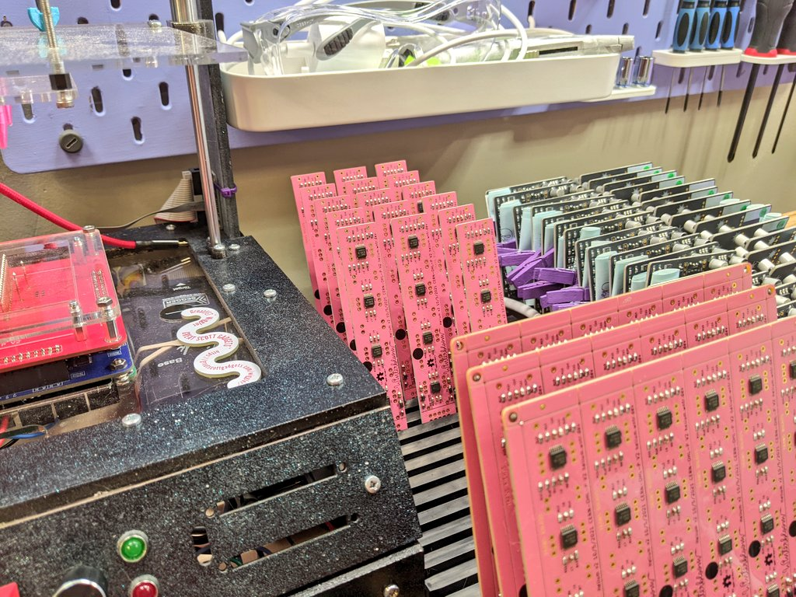
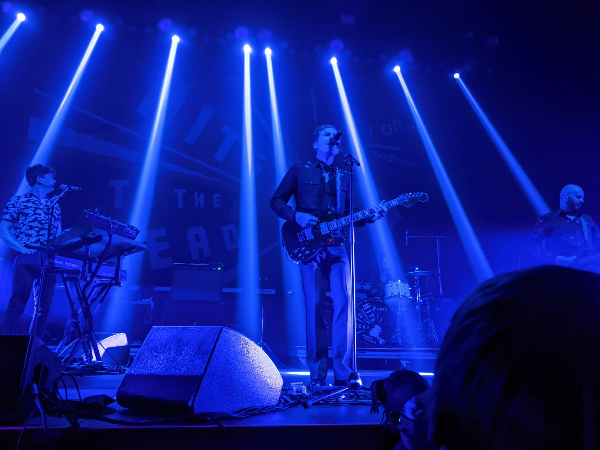
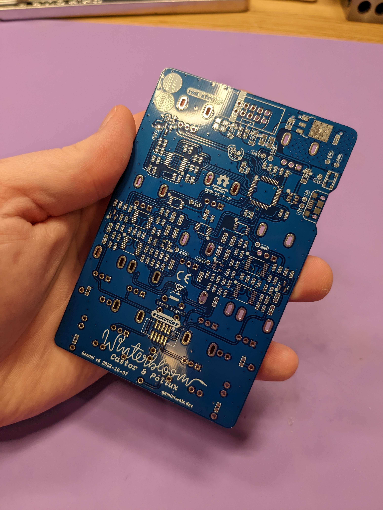

As 2022 comes to a close, I wanted to take some time to reflect on my experiences and accomplishments during the year. It's often valuable for me to write down the significant events before I forget how it felt to live through them. If you're used to my more technical articles you might want to sit this one out as I'll be talking a bit more about my personal feelings than technical details. But, if you're up for it, I hope it provides some entertainment.

## I bought an entire fucking house

With [Winterbloom](https://winterbloom.com) growing and consuming more and more of my personal space, I decided it was finally time to start looking for something with a bit more room for me, the sisters, and all of Winterbloom's stuff. We toured several houses in January and February and ended up making an offer on a house at the end of February.

It's a great fit for us- it had plenty of living space for all three of us with an entire finished daylight basement for Winterbloom. It's also literally 5 minutes away from the place we were living at before, so we didn't even have to adjust to a whole new area!

The house needed a little bit of work done so we stayed in our apartment until late March. In the meantime, we were able to get all of the big things taken care of - like having the deteriorating back deck re-done, leaking doors replaced, and *seventeen* year old hot water heaters replaced.

I also personally took on the task of removing the carpet in the basement and replacing it with vinyl plank, a hell of an undertaking to be honest.

After all the work we did on the house, actually moving was pleasantly easy due to how close our two places were. We didn't have to rush and stress to get everything packed, loaded, moved, and unload on one single day. It was a little wild seeing my new bedroom now that all the Winterbloom stuff had been moved down to the basement- there was basically nothing left in my bedroom!

Thankfully, the cats needed no time to settle in the the new place. I think they love having so many places to sneak around and hide.

## Winterbloom

My first order of business after moving was to build out Winterbloom's workspace:

Moving and building out our workshop absolutely put a huge dent in Winterbloom's operations, but despite that we still managed to have an alright year. The downtime is hard to take in the moment, but having an actual workshop is a total game changer.

Before the move we managed to get all the pre-orders for [Helium](https://helium.wntr.dev), [Hydrogen](https://hydrogen.wntr.dev), and [Speak to Me](https://speak.wntr.dev) out the door:

<blockquote class="twitter-tweet">
👋 We&#39;re back at work and we&#39;ve started shipping pre-orders for Speak to Me, Hydrogen, and Helium!  We&#39;ve also published the kit build guides for all three! 🤓<a href="https://t.co/03vaS3H8ry">https://t.co/03vaS3H8ry</a><a href="https://t.co/HsYfmAmLAS">https://t.co/HsYfmAmLAS</a><a href="https://t.co/8pEvj39PWm">https://t.co/8pEvj39PWm</a> <a href="https://t.co/KlSAjKPswq">pic.twitter.com/KlSAjKPswq</a>
&mdash; Winterbloom 🎛️ (@wntrblm) <a href="https://twitter.com/wntrblm/status/1479891999704719372?ref_src=twsrc%5Etfw">January 8, 2022</a></blockquote> 

Despite all of the work involved with the move and workshop buildout, we were able to start taking and shipping orders again at the [beginning of may](https://twitter.com/wntrblm/status/1522728781449994240).

I also had the chance to start working on a new product: [Micronova](https://micronova.wntr.dev). It's a tiny Eurorack power supply made especially for the DIYers out there.

I ended up designing Micronova during a bout of burnout and frustration. The move had taken a lot of my energy, and what was left was ruined by the ongoing chip shortage. I felt that any design I made wouldn't make it to production because I'd never be able to source the parts. Micronova requires only a handful of parts and it felt good to get *something* out.

While Micronova isn't a groundbreaking, must-have product, I am proud of it. It's a very practical design born out of difficult constraints.

Finally, but most importantly, I've been just absolutely blown away by the community in the Winterbloom Discord. They are one of the most wonderful, creative, helpful, and encouraging groups I've ever known, and I'm proud to even be a part of it! Winterbloom might have brought them together, but they really built that community into something special and I'm thankful for it every day.

## LumenPnP

One of the more exciting things I got to dive into this year was the [LumenPNP](https://opulo.io/products/lumenpnp), an open source pick and place machine for mid-scale manufacturing. Building more in-house assembly capability opens up a lot of possibilities for Winterbloom, and I'm just totally hyped about the idea of an open source pick and place. These kinds of machines *start* at $5-10k USD, so having one for ~$1,500 is incredible.

After building my initial machine, I dived head first into designing improvements and modifications, including linear rails for motion and even designing my own [control boards](../starfish-a-control-board-with-the-rp2040/) - more on that in a sec. I even learned how to use [FreeCAD](https://www.freecadweb.org/)!

I also joined the LumenPnP development team as a volunteer. It's been so awesome getting to know and working with Stephen, Lucian, Justin, and David. They are an incredibly brilliant, enthusiastic, and kind group of people and I'm so glad I can contribute in small ways to this project. I've been helping with organizing [community mods](http://mods.opulo.io), documentation fixes, triaging and responding to public issues, and providing guidance on hardware and firmware implementation. I'm excited to keep working with these folks and expanding the capabilities of small maker businesses.

## Starfish, Jellyfish, and Fishfood

I ended up going on a fun side quest by designing my own control boards for the LumenPnP. I made one that mounts on the toolhead and controls all of its components and another to control the components on the frame.

<blockquote class="twitter-tweet">
This trio of boards for my pick &amp; place control system are off to the fab! Starfish handles X &amp; Y axes along with vacuum pumps and other fixed accessories. Jellyfish handles the head- Z axis, two rotating heads, z-probing, and more! <a href="https://t.co/ocQrE7RpMY">pic.twitter.com/ocQrE7RpMY</a>
&mdash; Stargirl🌠 (@theavalkyrie) <a href="https://twitter.com/theavalkyrie/status/1569910289390346240?ref_src=twsrc%5Etfw">September 14, 2022</a></blockquote> 

These designs were so much fun. They're similar to 3d printer control boards so I had a lot of existing designs to reference. I got to learn how to use stepper motor controllers, got to do [weird things with ethernet](https://twitter.com/theavalkyrie/status/1548093708112842754), and got familiar with the [RP2040](https://www.raspberrypi.com/documentation/microcontrollers/rp2040.html). Of course, they're [open source](https://github.com/wntrblm/jellyfish-and-starfish).

I also wrote my own firmware for these boards from scratch in C: [Fishfood](https://github.com/wntrblm/fishfood). I'm planning on writing an article about how Fishfood handles motion calculation and controlling the stepper motors soon!

## OSHWA

Something I'm incredibly proud of is that I was [elected](https://www.oshwa.org/2022/10/27/2022-2024-new-board-members/) to the [Open Source Hardware Association](https://www.oshwa.org/) board of directors. This is an honor and I'm excited to help direct and multiply the efforts of OSHWA alongside the wonderful members of the board.

## Gingerbread

Back I began exploring better ways of adapting artistic designs to PCBs. There are existing tools, but none of them really integrated well into my workflow.

<blockquote class="twitter-tweet">
Alrighty, my Python toolset for converting PCB art created in <a href="https://twitter.com/affinitybyserif?ref_src=twsrc%5Etfw">@affinitybyserif</a> Designer to <a href="https://twitter.com/kicad_pcb?ref_src=twsrc%5Etfw">@kicad_pcb</a> is ready to play around with.  It&#39;s an early version and there&#39;s definitely bugs and edge cases, but hopefully it helps someone!<a href="https://t.co/7n6Zd7HIG7">https://t.co/7n6Zd7HIG7</a> <a href="https://t.co/Z0HB6lv6jQ">pic.twitter.com/Z0HB6lv6jQ</a>
&mdash; Stargirl🌠 (@theavalkyrie) <a href="https://twitter.com/theavalkyrie/status/1562140665156362240?ref_src=twsrc%5Etfw">August 23, 2022</a></blockquote> 

What an wild journey this turned out to be. *Gingerbread* is the name I've given to my set of tools to process and translate SVGs to KiCAD board files. It initially started with a [command-line driven, Python implementation](https://github.com/wntrblm/Gingerbread.py) but eventually involved into a fully browser-based application utilizing a native library written in [Zig](https://ziglang.org/) & C and compiled to [WASM](https://webassembly.org/). I hope to write a follow up article soon about the browser version and all the neat things I learned along the way- especially Zig!

Gingerbread is still what I'd consider "alpha" quality, but you're welcome to give it a try at https://gingerbread.wntr.dev.

## Wonderful moments with friends

The post-pandemic world is still so bizarre. While I still didn't do any traveling this year, I did have the chance to have some wonderful experiences with friends that occurred **outside**. Alana and I got to see The Strokes and The Red Hot Chili Peppers for the first time- something I've wanted to do since I was a teenager:

<blockquote class="twitter-tweet">
If she&#39;s your girl then why I am taking her to the RED HOT CHILI PEPPERS WORLD TOUR <a href="https://t.co/vlm8W3sRBI">pic.twitter.com/vlm8W3sRBI</a>
&mdash; Stargirl🌠 (@theavalkyrie) <a href="https://twitter.com/theavalkyrie/status/1557510724276076545?ref_src=twsrc%5Etfw">August 10, 2022</a></blockquote> 

Maggie and I were lucky enough to see and *meet* Metric- my favorite band of all time:

We also got to meet Carly Rae Jepsen!

Last but not least we also saw Franz Ferdinand:

I've missed live music so much. While it's still hard to go outside, I am thankful for the vaccines, masks, and safety procedures that are in place.

Maggie, Amber, and I also had a chance to go the Atlanta Zoo. I've been feeling really uninspired when it comes to photography, but it was nice to have an excuse to break out the camera and capture some lovely moments.

<blockquote class="twitter-tweet">
Some photos from the zoo today :) <a href="https://t.co/OQhLDGJpBr">pic.twitter.com/OQhLDGJpBr</a>
&mdash; Stargirl🌠 (@theavalkyrie) <a href="https://twitter.com/theavalkyrie/status/1583323123138469889?ref_src=twsrc%5Etfw">October 21, 2022</a></blockquote> 

And there's just so much more to even cover. From Maggie getting us in as extras in *two* Grouplove music videos to our fantastic holiday gift exchange ("Bitchmas") to me going absolutely overboard in 3D a Fortnite chest for a friend:

The pinnacle, though, is the absolute best birthday cake I've ever gotten, courtesy of Maggie:

## Future

I tend to have trouble sticking to long term plans, so I try not to plan too much out in advance. However, there are a few things I'm excited about as I look forward to the new year.

First, I just ordered the first run of Winterbloom's *Castor & Pollux II*. While I'm not quite ready to show the complete product, I can give you a little sneak peak:

Castor & Pollux II has a redesigned set of controls geared towards performance. It'll have new mode-based firmware that lets you switch up the interface controls to suit specific sounds. The new design also simplifies assembly for us, making it much easier to get them tested, assembled, and shipped. I'm really excited about this, and I'll have more to share in the spring.

Next, I'm excited about the [KiCAD](https://kicad.org) web viewers I've been working on. First shown in my [previous article](../starfish-a-control-board-with-the-rp2040/), it embeds interactive viewers for KiCAD schematics and boards.

<blockquote class="twitter-tweet">
The PCB viewer: <a href="https://t.co/Jnvol9wmtP">pic.twitter.com/Jnvol9wmtP</a>
&mdash; Stargirl🌠 (@theavalkyrie) <a href="https://twitter.com/theavalkyrie/status/1606403862356795392?ref_src=twsrc%5Etfw">December 23, 2022</a></blockquote> 

These are so exciting because they run in the browser and work directly with KiCAD's native formats. There's no need to use a plugin or exporter. There's so much potential for sharing and documenting designs. I'm so excited about this that I'm going to start seeking sponsorship specifically to develop it. It'll be my first time seeking sponsorship for a specific project, so it's going to be a bit of an adventure. I'll have more to share on that in the next week or so.

I'm also excited about writing more again. I really let things lapse for a long time last year because of the move and just burn out. However, I now have a backlog of well thought out articles to write and I'm excited to share them with y'all.

## See you next year!

