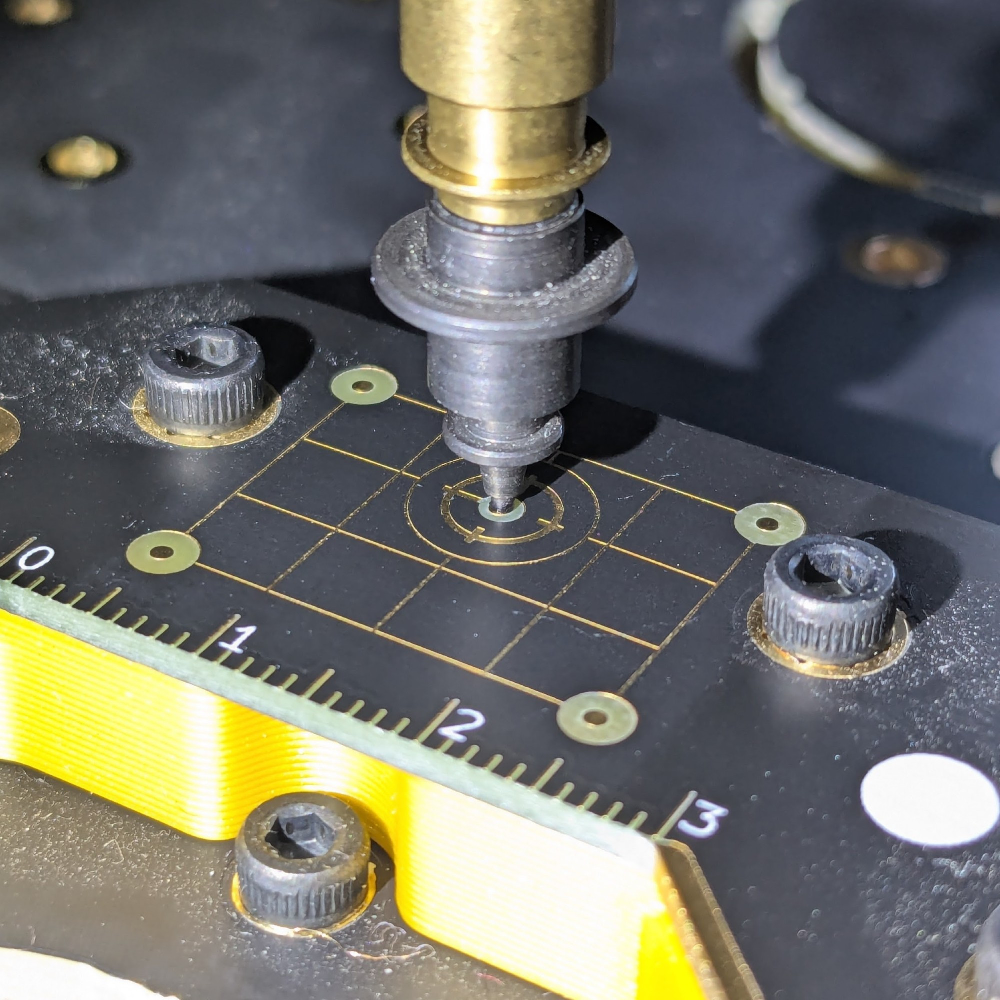
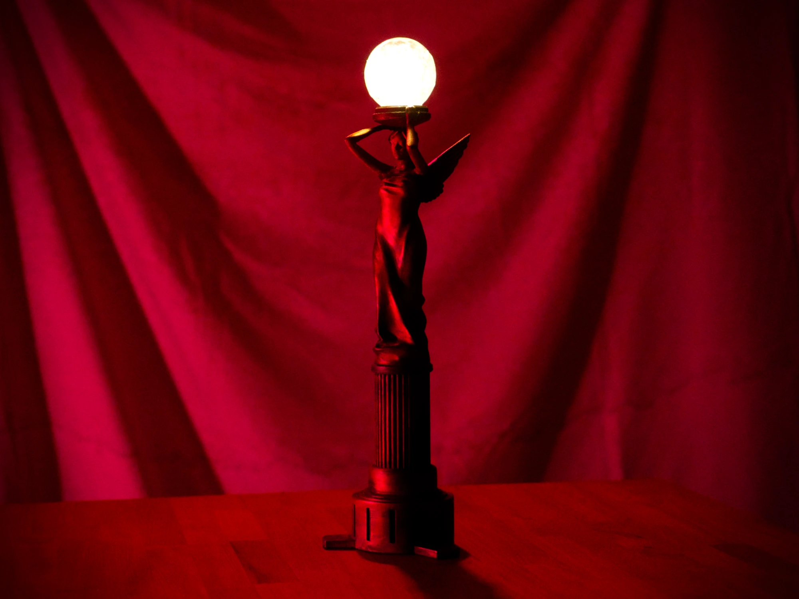

Just as with the last two years ([2023][2023], [2022][2022]), I wanted to take some to reflect on the last year. I've found that as I get older, my memory gets worse, so taking the time to write out a reflection helps me remember the good times. As always, this article is less technical than my usual content, however, I hope it provides some entertainment if you read through it.

[2022]: ../my-2022
[2023]: ../my-2023

## Appearances

I often feel rather reclusive - I'm very much a "homebody" and I like to stay in my owm little world, however, there were some reports of me being spotted in the wild last year.

I gave [a talk][voron-talk] about the [Voron][voron] community's unique approach to manufacturing at the [Open Hardware Summit][ohs-2024] in Montreal, Canada. OHS was a wonderful experience, and I can't express it better than [Kat][kat]:

> The Open Hardware Summit is what technology could look like if women, trans and queer folks, people of color, indigenous groups, and marginalized individuals were given their fair share of the technology spotlight.

Maggie and I had a [wonderful time][maggie-at-ohs] and it was wonderful to see so many friends and talk about the ways that technology can bring joy.

[voron-talk]: https://www.youtube.com/watch?v=HwTTLTjPG_Y
[voron]: https://vorondesign.com/
[ohs-2024]: [TODO](https://2024.oshwa.org/)
[kat]: https://x.com/kscottz/status/1786907226671603964
[maggie-at-ohs]: https://x.com/rasta_orange/status/1787175017949889020

I also showed up on **two** episodes of the [Open Hardware Manufacturing Podcast][ohm-podcast]:

- [Episode 16](https://shows.acast.com/ohm-podcast/episodes/thea-flowers) where we chatted about my journey from novice to open hardware advocate.
- [Episode 24](https://shows.acast.com/ohm-podcast/episodes/open-hardware-licenses) where we chatted about copyright and licensing and why it's so complicated, especially for hardware.

I always love chatting with Stephen and Lucian and, of course, I love yapping about open source. I was delighted that they invited me to crash their podcast twice- most podcasts never ask me to come back. 😅

[ohm-podcast]: https://shows.acast.com/ohm-podcast

I was also invited to [Makercast 57][makercast-57] with the incredible cast of Leeborg, Andy Q, Moth Box, and Charlyn. We talked about all sorts of things and I even gave an impromptu tour of my workspace. It was truly a joy to chat with this folks.

[makercast-57]: https://www.youtube.com/live/ojBJVDzbQ34

As an aside, I did **not** make an appearance at [Hackaday Superconference][supercon] this year. This was due to [my poor experience][supercon-experience] as a speaker in 2023. While I've had the chance to talk with someone from Hackaday about it, it ultimately seems like they're uninterested and uninvested in trying to do better.

[supercon]: https://hackaday.com/tag/2024-hackaday-supercon/
[supercon-experience]: https://x.com/theavalkyrie/status/1836428819126698072

## Winterbloom

As [recently announced][winterbloom], I'm winding down Winterbloom's hardware operations after 5 years. It's a little bittersweet, but I'm really excited about [what's coming next](#opulo) and I'm glad I got to end things on my own terms. Winterbloom was never meant to be a "forever" thing and I never really wanted to make a living off synthesizers. I wanted to explore and experiment with designing and producing open hardware, and I wanted to spark inspiration in others to do the same. I absolutely smashed those goals - Winterbloom was a resounding success in my eyes.

We also had our last hurrah in the form of [Neptune][neptune], a wonderful collaboration with fellow ATLien [Carson Walls][carson]. It's a *salty* diode filter with a lot of character and charm.

I wrote more words on the linked announcement, but Winterbloom really is its community. None of our accomplishments would've been possible without all of the lovely people in our community.

[winterbloom]: https://winterbloom.com
[neptune]: https://x.com/wntrblm/status/1754211721785340148
[carson]: https://www.decapoddevices.com/

## Collaboration with Maggie

Working with [Maggie][maggie] over the last four years has been one of my life's the greatest joys- they're my best friend and my partner in crime. They've been working towards their undergrad degree over the last four years while also being half of [Winterbloom][winterbloom]. For Maggie's senior thesis, they came up with the idea of collaborating on a unique combination of art and electronics - a comic illustrated by hand, fabricated by industrial processes, and brought to life with electronics and code:

I've made a lot of stuff in my life, but this project was truly special. I can't even express how much fun it was to transform Maggie's artwork into a massive 11x14" printed circuit board and how much attention I poured into [crafting unique animations][animations-tweet] for each panel.

Maggie is one of the most creative, genuine, and hard working people I've ever met. I'm lucky to know them, and I'd encourage all of you to [check out their work][maggie-bsky].

[maggie]: https://marms.art
[winterbloom]: https://winterbloom.com
[maggie-bsky]: https://bsky.app/profile/marms.art
[animations-tweet]: https://x.com/theavalkyrie/status/1770951008555806806

## Opulo

Excitingly, I've accepted a full time [role at Opulo][opulo-role-tweet]. Opulo is the folks behind the [LumenPnP][lumenpnp], a fully open source pick and place machine. I've been working with Stephen and Lucian over the last year on a part-time, contract basis but I wanted to give the project my full attention. I'm *stoked* to share more about what I'm working on in the new year, but I can only share some teasers for the time being.

I'm working on a project that involves controlling the machine in interesting ways. It's got me [working in Python][python-tweet] for the first time in years as well as going deeper into TypeScript. It's been fun [bouncing between the two][py-ts-missing-tweet], if sometimes [frustrating][py-ts-typing-tweet]. I even wrote my [own logging library][loglady-tweet] for Python.

I've spent some time iterating on the [architecture][glimmer-architecture], [twisting GCode to my will][gcode-tweet], getting into [various][cursed-webcam-tweet] [fights][webcam-transform-tweet] with web cameras and [winning][webcam-controls-tweet], and finding [leaks in every abstraction][skia-tweet].

I've also learned a **ton** about computer vision and taught my code to [find circles][fiducial-vision-tweet], detect nozzles using [contours][contours-tweet], [measure camera properties][camera-estimation-tweet] using multiple images, and absolutely nailed [visual calibration of nozzle position][nozzle-calibration-tweet].

I've also been working on a web-based interface for all this, which is build using Web Components and [Lit][lit]. I've made all kinds of fun elements like [buttons][buttons-tweet], [toggles][toggles-tweet], [range sliders][range-tweet], [dialogs][dialog-tweet], and even [an app shell][shell-tweet] with fancy [editor tabs][editor-tabs-tweet].

Needless to say it's been fun and there's _so_ much more to come. Stay tuned, I'm really, really excited about all this.

[opulo-role-tweet]: https://x.com/theavalkyrie/status/1856375789006241914
[lumenpnp]: https://github.com/opulo-inc/lumenpnp
[python-tweet]: https://x.com/theavalkyrie/status/1775898701015490727
[py-ts-missing-tweet]: https://x.com/theavalkyrie/status/1815482811450630215
[py-ts-typing-tweet]: https://x.com/theavalkyrie/status/1780323294991835424
[glimmer-architecture]: https://x.com/theavalkyrie/status/1816212924915994682
[webcam-transform-tweet]: https://x.com/theavalkyrie/status/1846222010571001857
[cursed-webcam-tweet]: https://x.com/theavalkyrie/status/1812549318764527667
[webcam-controls-tweet]: https://x.com/theavalkyrie/status/1838697103649841371
[fiducial-vision-tweet]: https://x.com/theavalkyrie/status/1845908278947336214
[gcode-tweet]: https://x.com/theavalkyrie/status/1772786402486362236
[skia-tweet]: https://bsky.app/profile/thea.codes/post/3lbsaxiqxuc2p
[camera-estimation-tweet]: https://bsky.app/profile/thea.codes/post/3lcycgzfvc22e
[contours-tweet]: https://bsky.app/profile/thea.codes/post/3lemlfb52rk2c
[nozzle-calibration-tweet]: https://bsky.app/profile/thea.codes/post/3lcvkdqy6ak2w
[loglady-tweet]: https://x.com/theavalkyrie/status/1768787170137940141
[lit]: https://lit.dev
[buttons-tweet]: https://x.com/theavalkyrie/status/1791135693554499931
[shell-tweet]: https://x.com/theavalkyrie/status/1799613561402208372
[editor-tabs-tweet]: https://x.com/theavalkyrie/status/1800353229097812417
[toggles-tweet]: https://x.com/theavalkyrie/status/1801717464675533260
[range-tweet]: https://x.com/theavalkyrie/status/1802119884391723497
[dialog-tweet]: https://x.com/theavalkyrie/status/1804189507673297297

## OSHWA

I continued my work within the [Open Hardware Association (OSHWA)][oshwa] last year, include serving as the [president of the board][president-announcement], pitching in on web design for the [2025 summit site][ohs-2025], and working to clean up and modernize our hosting infrastructure. I even had the delight of decommissioning a server running Ubuntu **10.04**!

OSHWA has been doing [some incredible stuff](oshwa-community-letter) and we've recently secured a major NSF grant which will enable us to far more in the coming years. I'm so honored to work with Alicia, Lee, Sid, and all of my fellow board members, they're seriously some of the most wonderful folks I've ever worked with.

[oshwa]: https://oshwa.org
[president-announcement]: ttps://www.oshwa.org/2024/01/14/welcome-thea-flowers-new-oshwa-board-president/
[ohs-2025]: https://2025.oshwa.org/
[oshwa-community-letter]: https://www.oshwa.org/2024/11/21/2024-end-of-year-letter-to-our-community/

## Making

Of course I spent a lot of time just *making stuff* this year. Probably what I'm most proud of is this incredible angel lamp prop from [Alan Wake II][alan-wake-ii]:

I made this for Maggie's awesome Alan Wake cosplay and it was a **ton** of fun. You can read the [entire writeup][alan-wake-lamp-writeup] for all the gory details!

I also designed a [tiny little guitar buffer][buffer-tweet] that mostly worked after [two revisions][buffer-tweet-2]! It's currently hiding *inside* my pedalboard since it's an always-on sort of deal. I'll be sharing the source for this soon, I have to make sure it can fit in an enclosure!

Looking back, I also did a bunch of other small things! I [repaired my PS5 controllers][dualsense-tweet], [printed a Fortnite crown tree topper][crown-tweet], [upgraded to a Galileo 2 extruder][galileo-tweet], [upgraded my Strat to locking tuners][strat-tweet], [swapped the knobs on my amp][amp-tweet], [got irresponsible with lasers][dickbutt-tweet], [went feral on cable management][cable-management-tweet], and even helped the [legendary Tom Whitwell][tomwhitwell] get up to speed with [KiCAD][kicad].

[alan-wake-ii]: https://www.alanwake.com/
[alan-wake-lamp-writeup]: ../alan-wake-angel-lamp-build/
[dualsense-tweet]: https://x.com/theavalkyrie/status/1828529183989104931
[crown-tweet]: https://bsky.app/profile/thea.codes/post/3ld5jf5cvk22b
[galileo-tweet]: https://x.com/theavalkyrie/status/1802046540715905472
[strat-tweet]: https://x.com/theavalkyrie/status/1748118035552964681
[amp-tweet]: https://x.com/theavalkyrie/status/1749823864312304004
[dickbutt-tweet]: https://bsky.app/profile/thea.codes/post/3ldkhzs35mk2r
[cable-management-tweet]: https://bsky.app/profile/thea.codes/post/3lefhxhdv6c2f
[tomwhitwell]: https://www.musicthing.co.uk
[kicad]: https://kicad.org
[buffer-tweet]: https://x.com/theavalkyrie/status/1748830737577783487
[buffer-tweet-2]: https://x.com/theavalkyrie/status/1756194187211391285

## Games, music, and media

I was thrilled to go see some live music this year, catching the [Postal Service & Death Cab for Cutie tour][dcfc-tweet] and [TWRP & Trey Magnifique tour][twrp-tweet]- and shoutout to Maggie for those awesome illustrations. While not technically live music, Maggie and I also caught [Stop Making Sense][stop-making-sense] in iMAX which was **awesome** and we saw [Across The Spider-Verse in Concert][spiderverse] which was a blast!

[dcfc-tweet]: https://x.com/marmsart/status/1783220297484693559
[twrp-tweet]: https://x.com/marmsart/status/1785657291749900765
[stop-making-sense]: https://www.imdb.com/title/tt0088178/
[spiderverse]: https://x.com/theavalkyrie/status/1834005240556949932

I played a **ton** of games this year! My favorites were:

- Alan Wake II's [Night Springs][night-springs] and [Lakehouse][lakehouse] DLCs, especially Lakehouse, which is such a [masterfully done critique][lakehouse-tweet] of art in the context of generative AI and exploitation.
- [Astro Bot][astro-bot] deserves all of the praise and awards it received. Every bit of this game feels fun and delightful, I smiled the entire way through. Its soundtrack is wonderful and I listen to it all the time when working.
- [Hades & Hades II][hades] captured my attention in a way very few games ever had. It's charming, rewarding, and just plain fun.
- [Penny's Big Breakaway][pennys] was a short, but sweet ride for me. From the unique but fun gameplay to the incredible retro-inspired but thoroughly unique graphics, it was a joy to experience. This soundtrack is also an absolute banger.
- [Stellar Blade][stellar-blade] ended up being a standout as well. the moment-to-moment gameplay is slick and engaging and the set pieces are awesome (seriously, there's a freaking **space elevator**!) While the story, voice acting, and direction are rough around the edges, it was never bad enough to distract from how fun the game felt. It also produced another excellent soundtrack!

I rolled credits for the first time on several games this year, including *Cyberpunk 2077*, *Until Dawn*, *Alone in the Dark*, *Deliver Us Mars*, *Neon White*, *Visions of Mana*, *Astro's Playroom*, *Ghostrunner* & *Ghostrunner 2*, *inFAMOUS: First Light*, and *Returnal*. I additionally swept up some platinum trophies for old favorites including *Psychonauts 2*, *What Remains of Edith Fitch*, *Beyond Good & Evil*, *Spider-Man: Miles Morales*, *Jedi: Survivor*, *Horizon Forbidden West*, *Horizon Zero Dawn*, *Odin Sphere Leifthrasir*, and *Alan Wake Remastered*.

Some of my favorite movies I saw this year were [I Saw The TV Glow][i-saw-the-tv-glow], [The Substance][the-substance], [Alien: Romulus][alien-romulus], [Longlegs][longlegs], [Abigail][abigail], and [The Portable Door][the-portable-door].

I didn't watch as much TV, but some of my favorites were [Severance][serverance], [The Boys][the-boys], and [3 Body Problem][3-body-problem].

[night-springs]: https://www.alanwake.com/story/night-springs-unraveling-mysteries-in-alan-wake-2s-first-expansion/
[lakehouse]: https://www.alanwake.com/story/enter-the-lake-house-and-discover-its-secrets-in-the-latest-expansion/
[astro-bot]: https://sonyinteractive.com/en/astro-bot/
[hades]: https://www.supergiantgames.com/
[pennys]: https://eveningstar.studio/games.html
[stellar-blade]: https://www.playstation.com/en-us/games/stellar-blade/
[lakehouse-tweet]: https://x.com/theavalkyrie/status/1848906359385010279
[i-saw-the-tv-glow]: https://a24films.com/films/i-saw-the-tv-glow
[the-substance]: https://www.rottentomatoes.com/m/the_substance
[alien-romulus]:https://www.20thcenturystudios.com/movies/alien-romulus
[longlegs]: https://www.longlegs.film/
[abigail]: https://www.rottentomatoes.com/m/abigail_2024
[the-portable-door]: https://www.rottentomatoes.com/m/the_portable_door
[serverance]: https://tv.apple.com/us/show/severance/umc.cmc.1srk2goyh2q2zdxcx605w8vtx
[the-boys]: https://www.amazon.com/gp/video/detail/B0CLWVYPXF/ref=atv_dp_share_cu_r
[3-body-problem]: https://www.netflix.com/title/81024821

## Friends

I had too many good times with friends to enumerate. From [hiding out in the mountains][mountains-tweet], to consuming way too much [boba][boba-tweet], to an absurd powerpoint night where my sister explained _all_ of the MCR lore to us, to Dragon*Con, Momocon, Ren Faire, and more, to celebrating the incredible accomplishments of my friends like Maggie's graduation. I had no shortage of wonderful moments with wonderful people. 😊

[mountains-tweet]: https://x.com/theavalkyrie/status/1766854753907085595
[boba-tweet]: https://x.com/theavalkyrie/status/1814841467338137840

## Looking ahead

I'm excited about 2025, despite feeling anxious about the overall state and direction of the United States. Moving on from Winterbloom was difficult, but making space has made me extremely excited and motivated. I can't wait to see what all of you create in 2025, and I can't wait to share some of the cool things i'm working on!

## See you next year!

