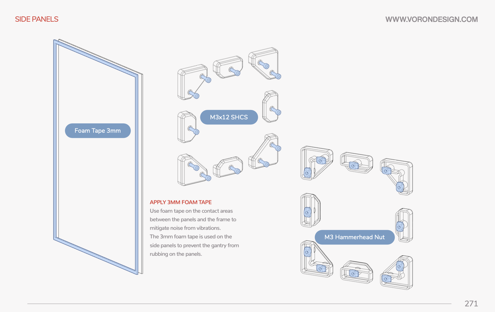

After three years of running my trusty dusty [Prusa MINI+](https://www.prusa3d.com/product/original-prusa-mini-semi-assembled-3d-printer-4/) as my one and only printer, I decided to jump in and build a [Voron 2.4](https://vorondesign.com/voron2.4). This post captures a bit of my experience and thoughts on the Voron 2.4 and the Voron project as a whole.

If you've never heard of Voron, it's an interesting concept: the Voron team develops the designs and documentation but does not sell printers or kits, instead, you can either self-source all of the various parts or purchase a kit from one of several vendors. This approach is really compelling to me, as it's one I hinted at in my recent [reply to Josef Průša](../a-reply-to-josef-prusa), where the success of an open source project is not tied to the success of a single corporate entity. Because of this approach, the Voron project has spawned a community with far more active participation than you'd find in typical 3D printers, with many users, designers, modders, and vendors all working on improving or adapting various aspects of the machine. It's really amazing, and I'll talk more about the community in a bit. First, let's talk about my build.

## The kit

While self-sourcing is certainly possible, I wanted to save myself the trouble of hunting down everything and decided to go with a kit. Community consensus seems to be that the [LDO kit](https://docs.ldomotors.com/voron/voron2) is by far the best, but it also carries the heftiest price tag at $1,399 (at the time of writing). That's an **expensive** kit, though you do get high quality components and it does include a [few nice extras](https://docs.ldomotors.com/en/voron/voron2). Since I knew I wanted to have fun with some mods and I didn't mind a bigger challenge, I decided to look for a cheaper kit.

The whole machine in one big box of parts

I settled on grabbing a kit from [voronkits.com](https://voronkits.com/collections/voron-kits/products/voron-2-4r2-kit-newest-model) for $879. These kits are made by [Formbot](https://www.formbot3d.com/), VoronKits.com is a US-based company that handles importing the kits and providing support. Since the kits are the same price as the ones from Formbot without the bother of shipping from China, it was a easy sell. Community consensus seems to be that the Formbot kits are passable, especially if you're experienced enough to diagnose and repair any issues that might creep up from the cost-optimized parts.

The kit itself was great from my perspective. The parts that really count and are harder to self source like the extrusions, linear rails, build plate, and bed heater all work great. It included genuine gates belts, Meanwell power supplies, a fresh [BTT Octopus](https://biqu.equipment/products/bigtreetech-octopus-pro-v1-0-chip-f446), and stainless steel hardware organized into nice bags with with plenty of spares. There's also a surprisingly high quality flexible magnetic PEI sheet with a smooth side and a textured side. It also includes pre-crimped wires for everything which is a huge time saver. Even though I planned on modifying the wiring later, it was nice to be able to get the printer up and running quickly without wasting time crimping wires. I also appreciated the included panels, since it can be a huge pain to source those and the panels are juuuust big enough that I can't laser cut them myself. Despite all of the good, there are some parts of the kit that leave a little to be desired: the fans are all pretty cheap, the magnetic sticker for the build plate is pretty meh, the foam tape has terrible adhesive and rips apart with alarming ease, the PTFE tube seems pretty rough, and god they included the worst imitation [VHB tape](https://www.3m.com/3M/en_US/vhb-tapes-us/). The hotend is a knockoff [V6](https://e3d-online.com/products/v6-all-metal-hotend) but it is an all metal hotend and it worked absolutely fine- I think it's a great choice for a budget kit since you probably want to replace the hotend anyway so you aren't paying extra for a fancy one you don't want.

Voron Stealthburner face printed in Plutonic Purple

The Formbot kit doesn't include the 3D printed parts required to assemble the printer. Voron has a community-organized [Print it Forward (PIF)](https://pif.voron.dev/) program that lets you get your parts printed by another kind soul who has a Voron. I love the concept and it's very true to the RepRap spirit. Since I was grabbing some bits and bobs from [Fabreeko](https://www.fabreeko.com/) I decided to order [my PIF parts](https://www.fabreeko.com/collections/v2-4/products/voron-v2-4-printed-parts-by-pif?variant=43645783998719) through them which was an all around excellent experience. I got my parts in [Plutonic Purple](https://fusionfilaments.com/1kg-abs15-filament-plutonic-purple) and they're quite pretty. One thing of note here is that this set doesn't include any of the non-essential parts, as it's expected that you'll print the rest yourself once you have a working printer. As a bonus, Formbot tossed in a handful of injection-molded parts for the LCD screen and exhaust that weren't in my PIF kit, so I was able to get those assembled before my first print.

## The build

Now the adventurous part: the build. I didn't take a lot of pictures during this time, but the build was generally pretty fun! All in all it took me about 3 days to build the "stock" printer with only some minor mishaps along the way. There were aspects of the build that I really enjoyed: putting the frame together is immensely satisfying, assembling the z drives is a lot of fun because it's such a neat little design, and the X/Y gantry is a great piece of engineering.

Frame complete

Gantry built and installed

The wiring was a bit fussy. The Formbot kit's included wiring has a lot of extra length which is great but also tends to be difficult to manage. I ended up using a lot of zip ties to hold everything together at first before I was able to print some better wire management stuff.

Initial wiring

I did run into one issue that could've been a showstopper- the stealthburner toolhead supports [a variety of different hotends](https://github.com/VoronDesign/Voron-Stealthburner/tree/main/STLs/Stealthburner/Printheads) and you specify which one you need when ordering the printed parts through PIF, but my parts came with the wrong mount. Thankfully, my Prusa MINI+ was up to the task of printing the right mount in PETG, which worked more than well enough for me to print a better one in ASA.

The PETG hotend mount held up well during ASA printing

The build documentation was mostly quite good, though, I do feel like there's room to improve. One thing I ran into is that it's sometimes hard to tell which part a step calls for, especially when some parts look *really* similar or are an unusual size.

There are two different sized sets of clips for mounting the panels and it's not immediately clear which set to use

There were also a few parts of the guide that came across as unnecessarily snarky or condescending. I'm all about humor, but in this case the joke is laughing at the user not with them, and it's just mean spirited.

I didn't find this as funny as the authors did

Also, as much as I love PDF guides since it's easy to print parts of them, I would've preferred the build guide as a web page. Web pages just have a lot more options for accessibility and it's easier to have multiple parts open at once. It would also be easier to contribute to! The only really strong argument for PDF documentation is printability, but With some care web-based documentation can still look incredible when printed.

## Klipper

Since it's still unnecessarily difficult to get your hands on a Raspberry Pi right now, I dug out an old Raspberry Pi 3B with 1GB of RAM to run [Klipper](https://klipper3d.org/), the fancy firmware recommended by the Voron guide. Setup was actually really easy since I used [MainsailOS](https://docs-os.mainsail.xyz/) which is a ready-to-go Raspberry Pi image that you can write to an SD card and get rolling. Klipper and Mainsail have no issues running on my slightly outdated Pi.

Getting Klipper running is really only part of the story since the real challenge is writing all of the configuration for your printer. Voron provides a [barebones set of configs](https://github.com/VoronDesign/Voron-2/tree/Voron2.4/firmware/klipper_configurations/Octopus) to get you started, but I was surprised at how Klipper doesn't include a number of quality of life features out of the box. My Prusa MINI+ has nice interactive ways of loading, unloading, and changing filament, automatically handles mesh bed leveling and purging before each print, and more that just make it easier to use. Klipper can do all of that but none of it is done for you at the start, instead, Klipper gives you a great deal of flexibility to define your own macros for these tasks. I understand the trade-off between convenience and customization, but I would've liked to have seen at least some basic ones for the Voron to get started with. I later found [Ellis' macros](https://ellis3dp.com/Print-Tuning-Guide/articles/index_useful_macros.html) and [RatOS's macros](https://github.com/Rat-OS/RatOS-configuration/blob/v2.x/macros.cfg) which are both a gold mine for useful macros, and they're great, I just think it's wild that Klipper is praised for being this huge evolution in printer firmware but requires diving deep in configuration files just to get basic stuff like filament swapping.

That said, I do really like Klipper. Once you've got it set up the way you like it's wonderful. The web interface provided by Mainsail is just miles ahead of dinky little LCD screens.

## Tuning

<video controls>
    <source src="./first-print.mp4" title="first print">
</video>

Oh, tuning, my least favorite part of printing. Voron recommends following [Ellis' print tuning guide](https://ellis3dp.com/Print-Tuning-Guide/) which is really useful and very opinionated but also weirdly sparse in some areas? The guide goes into incredible detail on a handful of settings but mentions absolutely nothing about other settings that can have a massive impact on print quality. I really wish there were better documentation for new users when it comes to setting up your slicer and getting prints looking great, as it does take a lot of patience and a lot of baseline knowledge to get this dialed in right.

## Mods & upgrades

This is my favorite part. I did a lot of mods after getting my printer up and running. Some I loved, some I didn't, but I'd like to share my thoughts on them.

### Snap latches

The very first thing I tried to do was replace the panel mounts with [magnetic ones](https://mods.vorondesign.com/detail/GawFyXN2J0rlSecCAJUpZQ) so I could easily remove them when printing PLA. Oh, how I wanted these to work and how they just didn't. Perhaps my magnets weren't strong enough but I just couldn't get the panels to stay on consistently. They would fall off the printer and then hit the floor and break off the panel clips. Getting the matching magnetic pieces into the 2020 extrusion was also just a huge pain the butt. In the end I gave up and moved to a different option - [snap latches](https://mods.vorondesign.com/detail/9Rdnf5vD2oaJLmR7BpAuQ).

The snap latches were everything I wanted the magnetic panel mounts to be and more. They're so well designed, super easy to print, and go together quickly. They only require an M3 bolt and T-nut to attach them to the frame but are otherwise completely 3d printed. They have a very satisfying **snap** when closed and hold the panels to the frame fairly tightly. They're great and definitely a mod that I can recommend wholeheartedly.

### Handles

Moving the printer around without handles is *rough*. I'm so surprised this design doesn't include handles despite including a significant number of aesthetic parts.

No worries though, since I found [these handles](https://mods.vorondesign.com/detail/EAM1ZiQJCUzXznvOA767w) designed for the 2.4 that work incredibly well. They're well designed, super sturdy, and easily to print. I highly recommend going ahead and having these ready before you build your machine.

### Chamber lighting

The stock build is pretty but it's so dark in that enclosed space! Lighting is a must in my opinion, as it's just so hard to even tell if your printer is doing the right thing without proper lighting. The first few prints I did I had to use a handheld LED flashlight to get a look at stuff!

There's a great mod for using [these individual clips](https://mods.vorondesign.com/detail/8S6KN4daUCgRhEJEX1stQ) to mount a common 10mm LED strip to the frame. I went with [these LEDs](https://www.amazon.com/gp/product/B00XH59VG4/ref=ppx_yo_dt_b_search_asin_title?ie=UTF8&psc=1) and they work great and are super bright. I actually found out halfway through printing that Adam from Vector 3D made a [tweaked version](https://github.com/AdamV3D/V3D-Voron-Mods/blob/main/v2.4/Flexible%20LED%20Baffle/V3D%20LED%20Bar%20Clip%20Mount%20Hollow%20v1.stl) of these clips that are hollow inside which makes them print faster with less material, so I'd recommend going for those instead of the usual ones!

I used the [corner cable cover with drop holes](https://mods.vorondesign.com/detail/rXJYi9H1vNzno2fZlwAB3g) to route the cables connecting the strip segments together and used the [2020 profile covers](https://mods.vorondesign.com/detail/8PtM9BKgRdBUN7CZ8g6Q) to hide the wires routing up from the control board to the LEDs. I wired the LEDs up to my Octopus board's spare heater output.

### Camera

It's nice to be able to see what's going on with the printer without having to watch over it like a concerned mother. I initially made the [Angry Cam](https://mods.vorondesign.com/detail/RYpQW53mtem8Nj1JKqiSQ) which worked okay and has a nice compact design, but I really didn't like the narrow field of view of the camera module I got. So instead I just ordered the [cheapest high FOV camera on Amazon](https://www.amazon.com/gp/product/B0BMKQ7KMG) ($15!), disassembled it, and then drew up a very simple mount for the board in FreeCAD. It ain't pretty, but it works great.

Routing the wires through the Angry Cam is tedious since you have to remove the connector, run the wires through a tight bend, and then put the connector back on. I can't say I'd recommend the angry cam unless you're sure you have a compatible camera module that'll give you the view you want. I might mount the Angry Cam to the bottom of the X/Y gantry to have two different views of my prints, but I also might not bother.

### Cable management ducts

I used a couple of these [cable management ducts](https://mods.vorondesign.com/detail/YTmSPTcWpctfTKQj3bOPg) to tame some of the wild wiring. These helped a lot with managing the extra length on some of the wires and were super easy to print. I installed them using VHB tape. My only complaint is that I did manage to break some of the comb bits but with a little caution it's easy to avoid that. I later found [another design](https://www.printables.com/model/279450-trunking-cable-management-channel) that includes more size options if you want to try those instead. These are so useful that I can definitely recommend them for any build.

### The Nevermore filter

The [Nevermore](https://github.com/nevermore3d/Nevermore_Micro) filter is a great addition especially if you're printing ABS or anything that releases [VOCs](https://www.epa.gov/indoor-air-quality-iaq/what-are-volatile-organic-compounds-vocs). It's also a good choice if you're trying to get your enclosure up to temperature, since it can circulate warm air from under the heated bed. It mounts under the heated bed so it doesn't even take up any real space in the printer!

I ended up building the [V5 Duo](https://github.com/nevermore3d/Nevermore_Micro#nevermore-v5-duo) using two sweet [Delta BFB0524HH fans](https://www.digikey.com/en/products/detail/delta-electronics/BFB0524HH/1014447). Definitely don't skimp on the fans since you want powerful, reliable fans here. I filled mine up with [carbon from West3D](https://west3d.com/products/premium-activated-carbon-pellets-for-voc-odor-removal-and-nevermore?_pos=1&_sid=ea7fa3881&_ss=r).

The Nevermore works great and is a must have in my opinion. Right after I finished printing mine, they released the [V6](https://github.com/nevermore3d/Nevermore_Micro/tree/master/V6) which seems to be an improvement in all aspects, so I'd recommend going with that!

### GE5C Z joint

One of the key distinguishing design features of the Voron 2.4 is its flying, belted gantry driven by four independent z-motors. This design avoids the [z-banding](https://all3dp.com/2/3d-printer-z-banding/) artifacts introduced by lead screw designs seen on most bedslingers. However, this design introduces more complexity and has its own set of issues. One of the most critical parts of the design is how the gantry mounts to the rest of the frame as it needs to rotate/tilt a little to allow for aligning the gantry. The Voron 2.4 uses Z joints that have two 3D-printed parts that form a ball joint, relying on the bolt to be slightly loose to allow the parts to move:

The [GE5C Z joint mod](https://mods.vorondesign.com/detail/eB5T2RNQcYI4o6cilhpXEg) replaces these Z joints with [spherical bearings](https://west3d.com/products/ge5c-spherical-bearing-nsk?_pos=1&_sid=c29aa56c8&_ss=r). This removes the bolt tightness as a factor and allows the joint to tilt freely without binding.

I'm not entirely sure how much this mod helps since I didn't do a ton of before and after comparison, but it seems to work at least as well as the stock joints. So uh, I don't know, do it if you wanna.

### Removeable doors, better door handles, and better latches

I wanted to be able to remove the doors for the same reason I wanted to remove the panels - to allow airflow for printing PLA. I initially tried these [slick magnetic boys](https://www.printables.com/model/221377-voron-24-magnetic-door-hinges) but I kept just ripping the whole door off like the Hulk.

Instead, I ended up going with these beefy [removable door hinges](https://mods.vorondesign.com/detail/WqhhKrXksAZ4omhHS1RY4Q). They ostensibly should be screwed onto the door panels but I just used VHB tape since there's more than enough contact area for a nice solid connection.

I also **hated** the stock door handles and magnetic latches because they have such a small contact area with the VHB tape that they just wiggle around and are easy to pull off. I removed those dinky handles and put on these [solid handles](https://www.printables.com/model/261630-voron-door-handle) which I scaled down to about 80%. Instead of using magnets to hold the doors closed I just put on some more of those snap latches.

I can definitely recommend this combination for anyone who wants to switch between enclosed and non-enclosed printing often. The doors are easy to open, easy to remove when needed, and are easy to thoroughly seal.

### Flex plate stops

One of the quality of life features on my Prusa MINI+ that I love is that it's so easy to install and align the flex plate because of these little stops on the heated bed:

From <a href="https://help.prusa3d.com/article/flexible-steel-sheets-guidepost_2195">the Prusa Research knowledgebase</a>

I was sorely missing those on my Voron as I was having to place the flex plate, lift, adjust, and repeat until it was close enough to where I wanted it. Thankfully, I found these great [flex plate stops](https://www.printables.com/model/411428-voron-24-flex-plate-stops) that are super straightforward to install and use. This one is a must - it's such a simple mod and makes your life so much easier.

### Stealthburner PCB

There's a whole mess of wires that snake their way through the cable chain up to the toolhead and it can be huge pain in the ass to deal with them when working on the toolhead. [Hartk's Stealthburner PCB](https://github.com/hartk1213/MISC/tree/main/PCBs/Stealthburner_Toolhead_PCB) makes all of that a lot easier to manage- it's a breakout board that mounts to the toolhead and allows you to easily disconnect and replace various parts of the toolhead without needing to fuss with a big nest of wires.

I grabbed mine from [SIBOOR](https://www.aliexpress.us/item/3256804865305360.html) and I was honestly a little let down by the quality. The PCB isn't the newest revision and feels a bit flimsy. I'm not sure if it's in the original design but the though hole solder pads are so small that the solder joints can't provide a lot of mechanical strength to the through hole connectors making them feel super loose. If you decide to do this mod, I'd recommend getting your boards from a different vendor.

Depending on your own preferences this might be a mod worth doing, or it might make more sense to go for a CAN-based toolhead controller like the [Mellow Fly SB2040](https://www.aliexpress.us/item/3256804488949799.html). I have one of those on the way and I'm excited to give it a try.

### Tap and tap again

The Voron 2.4 specifies an inductive Z probe along with a physical Z endstop switch, but the new hotness is the [Voron Tap](https://github.com/VoronDesign/Voron-Tap). Tap replaces both of those and uses the nozzle itself to probe the bed, an approach that should, in theory, be more accurate and require less fiddling with the Z offset. It's a pretty interesting mechanical design, as it allows the entire toolhead to slide upwards to trigger an optical switch.

From <a href="https://github.com/VoronDesign/Voron-Tap">VoronDesign/Voron-Tap</a>

I grabbed a [Voron Tap kit](https://www.aliexpress.us/item/3256805118443238.html) from SIBOOR on Aliexpress, which is one of the cheaper kits available. The quality was passible, though the included magnets were pretty weak and I'm suspicious of the optical switch. I initially built out my tap with SIBOOR's printed parts and everything seemed to work mostly okay, but I did find myself having to adjust the Z offset on every print.

I found out literally the next day that [Tap R8](https://github.com/VoronDesign/Voron-Tap/blob/main/Manual/R8_errata.md), a newer revision, was available and fixes some of the reliability issues with the version I had. I went ahead and re-printed the parts and rebuilt my Tap. I kept the optical switch and linear rail from the SIBOOR kit but replaced the magnets with high-quality [N52 magnets from JC Magnetics](https://jc-magnetics.com/6x3mm-Epoxy-Coated-Neodymium-Magnets). I can definitely say that R8 is much more reliable for me as it performed much better on the [probe accuracy tests](https://github.com/sporkus/probe_accuracy_tests) and I haven't had to touch my Z offset at all, even between thermal cycles!

I did have some trouble with bad wiring which was totally my fault, but once I replaced the wiring everything worked smoothly. I'm not sure if I can recommend Tap for everyone at this point, but, if you like the idea of it and are feeling adventurous, go for it!

### Vibration dampening feet

The Voron uses some nice guitar amplifier style feet but they are a little on the stiff side, so they don't absorb as much vibration as I'd like. Also, the shelf my Voron lives on is very sturdy but a little bowed, so it causes the machine to wobble. I solved both of those problems with some [sorbothane](https://en.wikipedia.org/wiki/Sorbothane) vibration absorbing discs. If you've never heard of or used sorbothane before, it's a weird but incredibly useful material that is really fantastic at sound dampening and vibration isolation. They're just soft enough to squish enough to stop the wobble on my shelf. You can grab legit ones from [Isolate It! on Amazon](https://www.amazon.com/Isolate-Sorbothane-Vibration-Isolation-Circular/dp/B019O5RJN2) or [McMaster](https://www.mcmaster.com/products/sorbothane/).

### Steel sheet

As I mentioned above, the magnetic flexible spring steel sheet included in my Formbot kit is actually quite nice- it's double sided with one side textured and the other smooth. [Extras](https://www.formbot3d.com/products/double-sided-flexible-pei-sheet-for-voron-24-or-trident?VariantsId=10881) can even be had for about $25.

From <a href="https://www.formbot3d.com/products/double-sided-flexible-pei-sheet-for-voron-24-or-trident?VariantsId=10881">Formbot</a>

However, I'm really fond of the [Prusa satin sheet](https://www.prusa3d.com/product/double-sided-powder-coated-pei-satin-spring-steel-sheet/) that I use on my Prusa MINI+, so I wanted something similar to that. After some research, I settled on an [Ultistik](https://ultistik.com/) plate - specifically the [310mm x 310mm one](https://www.amazon.com/dp/B091BCGZCJ?ref=myi_title_dp) since they were out of the 300mm x 300mm ones. Being slightly oversized isn't an issue in this case. The sheet itself is great and has an excellent texture that's nicely between smooth and textured. PLA, ABS, and ASA stick to it fantastically and even more so with a very light application of common purple glue stick.

From <a href="https://www.amazon.com/dp/B091BCGZCJ">Ultistik</a>

Unfortunately, at the time of writing it looks like Ultistik is in a bit of limbo. Their [website](https://ultistik.com/) is still up but it's just a simple landing page. The sheets are actually made by [FilamentOne](https://www.filamentone.com/) but it seems like their store was taken offline sometime in the last two weeks. Their Amazon store is still up so hopefully this is just a temporary interruption but it is concerning. I have heard very good things about the [OSEQ sheets](https://oseq.io/products/oseq-safe-sheet-300x300mm) but they are **very** expensive and currently have a very long lead time and there's been some reports of them just not responding at all to emails.

### Spindicators

I like being able to easily tell if the part or hotend fan is spinning, so I designed these [spindicators](https://www.printables.com/model/518360-spindicators-for-fans) inspired by the designs commonly seen on [jet engines](https://isaaclow.medium.com/what-is-the-objective-of-the-spirals-drawn-on-jet-engines-c144ef659d16).

I made them using a vinyl cutter and some inexpensive holographic vinyl, but you can also 3d print them and glue them on if you're into that. They're a cute little addition and they bring me joy to see them spinning around.

### Nozzle cleaning brush

Since I switched to tap, it's important that the nozzle doesn't have any filament stuck to the end of it before probing. It's also good to keep the nozzle clean before printing some gunk doesn't end up on your print. You can use a [wire brush](https://west3d.com/products/copper-wire-nozzle-cleaner-brush?_pos=1&_sid=89037864b&_ss=r) to manually clean the nozzle but you can do it even better by mounting one next to the bed so the machine can do it automatically.

I ended up going with [this design on Printables](https://www.printables.com/model/381631-voron-24r2-nozzle-cleaner-purge-bucket), though it seems many users like [this one instead](https://mods.vorondesign.com/detail/eiGz71BOprk2GapXbQVgA). Either way they accomplish the same thing. 🙂

### Spool holder

The 2.4's spool holder sticks out the back so you mount filament spools to the back of the printer. Even without the spool, the 2.4 already has a big footprint that demands a deep shelf or desk, with the spool it's just too much.

I'd much rather place spools on the top or the side. There's a few options out there for different spool holders, but I ended up going with [this one](https://www.printables.com/model/227260-voron-24-top-mount-single-dual-spool-holder) that holds two spools on top of the printer.

It works well enough, although I'm not the biggest fan of the Voron-style posts that use PTFE tube instead of bearings to let the spools roll. The PTFE tube just has too much resistance for cardboard spools and I use a lot of those because I primarily print with [Polymaker](https://us.polymaker.com) filament.

### Extruder gears

My Formbot kit included the necessary BMG-style extruder gears needed to assemble the Clockwork2 extruder and they seemed to work okay, but I quickly replaced mine with some fancier [RNC nano coated components by TriangleLab](https://west3d.com/products/bmg-components-kit-by-trianglelab).

I can't speak on the quality of the Formbot parts since I didn't really spend a lot of time with them, but I can say that the TriangleLab parts are great. These gears are some of the most critical parts of a 3D printer so it's worth investing in quality parts.

### E3D Revo

As I mentioned above, my kit included a decent V6-style hotend that worked perfectly well but I wanted to try out [E3D's RapidChange Revo](https://e3d-online.com/blogs/news/rapidchangerevo). Revo is really neat because it allows you to quickly and easily change nozzles without any tools and without needing to bring the hotend up to temperature. I grabbed a [Revo Voron](https://www.filastruder.com/products/e3d-revo-voron) and some fancy [PTFE tubing](https://west3d.com/products/capricornus-ptfe-tube-1-9mm-teflonto) for my hotend.

From <a href="https://www.filastruder.com/products/e3d-revo-voron?_pos=1&_sid=2f4c588f3&_ss=r&variant=39567818948679">Filastruder</a>

I like the Revo, however, it has a lot of drawbacks. The nozzles are limited, proprietary, and expensive - coming in at around $26 for a single brass nozzle compared to less than $10 for typical brass nozzles. Their wear-resistant [ObXidian](https://e3d-online.com/blogs/news/revo-obxidian) nozzles are twice as expensive at around $60 and their newly-introduced and hard-to-find [high flow](https://e3d-online.com/blogs/news/revo-high-flow) nozzles come in at just under $50. That is a **really steep** price to pay! Especially compared to V6 style nozzles which are available from a variety of manufacturers and are compatible with a wide range of hotends. Even high-end offerings like the [Bondtech bi-metallic CHT](https://www.matterhackers.com/store/l/bondtech-cht-bimetal-coated-nozzles/sk/MYWNFF4S) ($40), [DYZE tungsten carbide](https://www.matterhackers.com/store/l/dyze-design-m6-tungsten-carbide-nozzle/sk/MRDWS1KC) ($55), and [3D Solex ruby CHT](https://www.matterhackers.com/store/l/3d-solex-printcore-everlast-ruby-sapphire-cht-nozzle/sk/MAD7CNAR) ($75) are far more cost effective than the Revo.

I'm not sure I'll keep the Revo long term, but it has been interesting to use and see in action. I hope we see similar innovation from other manufacturers and hopefully the cost will eventually come down.

## The community

Finally, I wanna share a bit about my experience with the community since Voron *is* its community. Overall, my experience was really positive- I really love how freely folks share their builds, experiences, and modifications for others. I love the collaboration between the designers, community, and vendors. For the most part, folks and organizations seem genuinely investing in making everything better for everyone.

However, nothing is perfect. Voron's community is spread across a bunch of platforms. There's the [official forums](https://forum.vorondesign.com/), the [TeamFDM forums](https://forum.vorondesign.com/), the [official Discord](https://bit.ly/VoronDiscord), and a [subreddit](https://reddit.com/r/vorondesign). Since the Voron subreddit remains private in the face of Reddit's recent policy changes, a large amount of discoverable knowledge has been lost. The Discord seems to be the most used and contains both an active user base and a ton of accumulated knowledge. Unfortunately, this knowledge mostly stays confined to Discord where it becomes harder and harder to discover and share over time. The Discord users are generally helpful, but some have fallen into the pattern of scolding new users for not reading pinned threads or knowing some other assumed knowledge. This culture combined with the high amount of activity and the extraordinarily large amount of channels leads to an environment that can be difficult for some to participate in.

## Wrapping up

So that's my Voron build so far! I'm looking forward to doing some more modifications to it and learning even more about the world of CoreXY 3D printers. I hope this post has been informative, useful, or at least entertaining for you.
