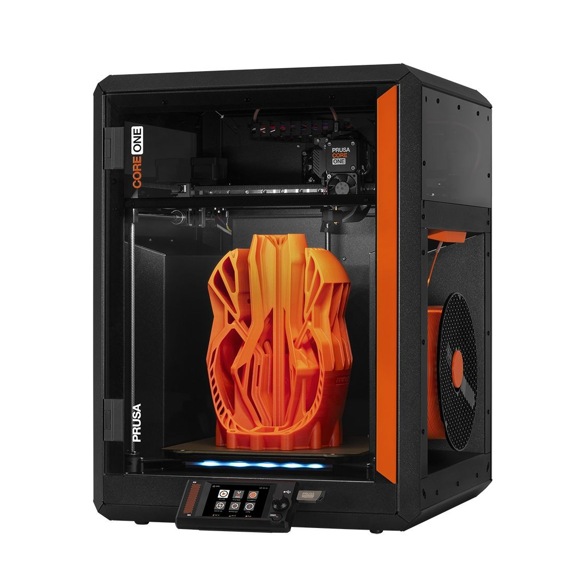
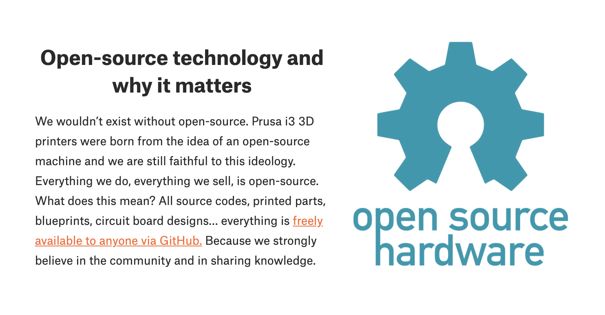

> This post is a follow-up to my post [*A reply to Josef Průša*][a-reply] from last March.

Last week, Prusa introduced the [CORE One][core-one], it's new, fully enclosed CoreXY 3D printer. In many respects, it's exactly what customers have been asking Prusa to create since [Bambu Lab][bambu-lab] shook up the market in 2022.

In other respects, it's a massive disappointment as it marks the [death of Prusa's open hardware][hackaday-article] and fundamentally misses *why* Prusa has struggled to compete in the consumer 3D printing space.

## Open Hardware

Open source hardware isn't just a buzzword or a warm fuzzy feeling, it has a [definition][oshw-definition] and a [certification][oshw-certification] that was crafted by the very people who made open source hardware a reality. Prusa's own [Prusa Mini][prusa-mini-cert] is certified OSHW. Prusa's own [about page][prusa-about] explains the importance of OSHW to Prusa:

Prusa built and ran their company on open source- their core hardware designs evolved from [RepRap][reprap], their firmware is a wrapper around [Marlin][marlin], and their slicer is an evolution of [Slic3r][slic3r]. They have obviously contributed so much back to the community as they've put enumerable amounts of work into these projects in the course of bringing their machines to life and to market.

But that isn't the end of the story. Prusa's own statement speaks of a Prusa that no longer exists. Since facing increasing competition from non-Western companies like Creality and Bambu, Prusa has chosen to turn its back on the very community that it built itself around. Despite Josef Prusa's insistence that open source allows competitors to "steal" his company's work and contribute nothing back, that is categorically false - I went into further detail in my [previous post][a-reply], but as a pithy one-liner consider that Creality has [3 OSHWA certified printers][creality-certs] to Prusa's [one][prusa-certs].

That means that as of the time of writing this blog, **it's actually easier and cheaper to buy a certified open source 3D printer from Creality than Prusa.**

It is important to note that Prusa hasn't completely abandoned all of the principles of Open Source hardware. The Core ONE will still allow and encourage folks to repair and modify their machine, but these things are poor imitations of the true freedom that comes with _real_ open hardware.

The Hackaday article sums this up well:

> So will the Prusa Core ONE be a good printer? Almost certainly. Will I buy one? Very likely. But part of me will always be disappointed that the guy with the open source hardware logo tattoo took his ball and went home as soon as the game starting getting tough.

As someone with their [own open hardware tattoo][oshw-tattoo], yeah, I'm really disappointed.

## Losing the market

Drew DeVault's [post from last year][drew] nailed it:

> Prusa made one of the classic errors in open source business models: they made their product, made it open source, sold it, and assumed that they were done working on their business model.

Prusa is not losing the market because they open sourced their hardware. They're losing because they failed to innovate and failed to grow their userbase.

Here's an easy example: The Core ONE looks awesome! However, it doesn't bring anything fundamentally new or innovative to the market. Let's compare it real quick to their competition, Bambu Lab:

|                                | Prusa Core ONE  | Bambu Lab P1s | Bambu Lab X1 + AMS |
|--------------------------------|-----------------|---------------|--------------------|
| Price, incl taxes & shipping   | $1,412          | $588          | $1,284             |
| Arrival date                   | After Jan, 2025 | Today         | Today              |
| Build volume                   | 250x220x270     | 256x256x256   | 256x256x256        |
| Multi-material                 | $359            | $249          | Included           |
| Warranty                       | 1 year          | 1 year        | 1 year             |

(This is based on shopping right now from Atlanta, Georgia, your results will vary)

This is as plain as I can make it: Prusa is losing sales because their printers are **expensive** and **hard to get**. I can go to MicroCenter today and take home twice as many printers for the cost of a single Prusa that won't arrive until next year.

Of course the argument ignores other aspects - the Prusa is more easily repaired and upgraded, and Prusa's support is ostensibly better than Bambu's. But it doesn't matter, the point is Prusa **can not** win with manufacturing alone and by turning their back on open source, that's what they're trying to do.

## Closing thoughts

In my [last post][a-reply], I implored Prusa not to go down this path:

> Please reconsider and choose to empower your community instead of punishing your ecosystem.

They've learned nothing. Their product is their brand, and while their brand has been able to sell expensive, hard to get printers in the past, I doubt it can do so for long if Josef intends to keep alienating the Open Source community. It feels like they're trying to be Bambu Lab, just European, and I believe that is a fundamentally bad strategy.

I hope I'm wrong.

[a-reply]: ../a-reply-to-josef-prusa/
[core-one]: https://www.prusa3d.com/product/prusa-core-one/
[bambu-lab]: https://bambulab.com/en-us
[hackaday-article]: https://hackaday.com/2024/11/20/with-core-one-prusas-open-source-hardware-dream-quietly-dies/
[oshw-definition]: https://certification.oshwa.org/requirements.html
[oshw-certification]: https://certification.oshwa.org/
[prusa-mini-cert]: https://certification.oshwa.org/cz000002.html
[prusa-about]: https://www.prusa3d.com/page/about-us_77/
[creality-certs]: https://certification.oshwa.org/list.html?q=Creality
[prusa-certs]: https://certification.oshwa.org/list.html?q=Prusa
[drew]: https://drewdevault.com/2023/12/26/2023-12-26-Prusa-is-floundering.html
[oshw-tattoo]: https://bsky.app/profile/thea.codes/post/3lbpmjlbo5k2t
[reprap]: https://reprap.org/wiki/RepRap
[marlin]: https://marlinfw.org/
[slic3r]: https://slic3r.org/
