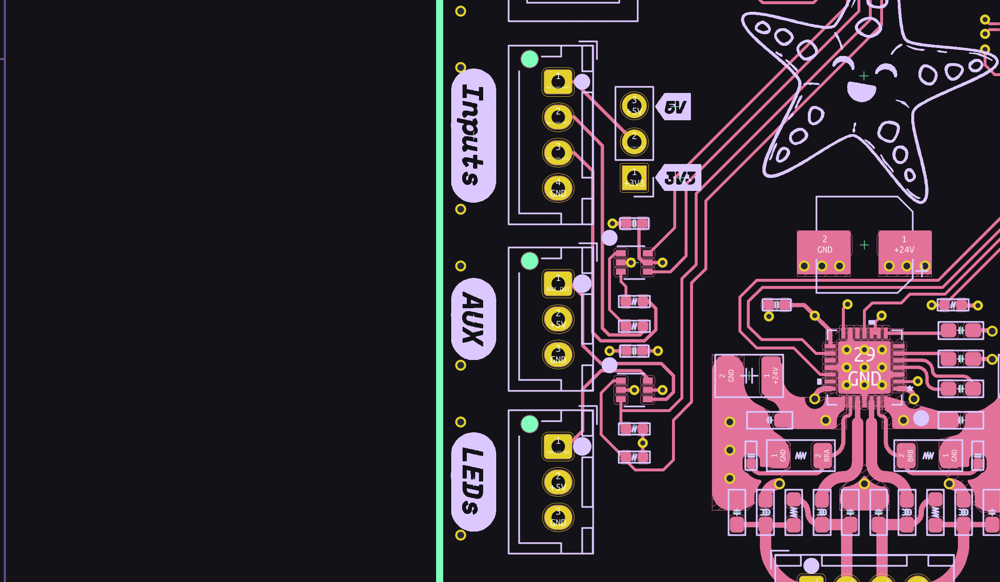
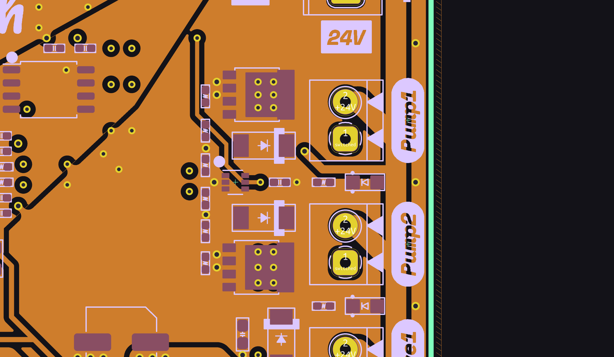

This article will explore the hardware design of **Starfish**, a control board for a pick and place machine built around the Raspberry Pi [RP2040] microcontroller and Trinamic [TMC2209] motor drivers.

This control board shares some similarities with 3D printer control boards but it has some unique problems to solve- including controling solenoids and talking to vacuum sensors. I'll take you through the background, schematics, and layout, along with the decisions made. Starfish is open source, so you can check out the original source files on [GitHub].

If you want to quickly jump to a specific section, here's a table of contents:

[TOC]

## The Lumen

Fist, some background: Back in May, I assembled my very own pick and place machine - a [LumenPnP from Opulo](https://opulo.io). It's a wonderful open source project that aims to bring the power of these expensive industrial machines into reach for makers and small businesses. Here's a quick video about it:

<iframe width="560" height="315" src="https://www.youtube-nocookie.com/embed/pNxXp2LdjzU" title="YouTube video player" frameborder="0" allow="accelerometer; autoplay; clipboard-write; encrypted-media; gyroscope; picture-in-picture" allowfullscreen></iframe>

My Lumen is a beautiful shade of [Polymaker Teal], and its first incarnation was a wonderful sight:

However, being, well, *me*, I couldn't just leave it as-is! I immediately started working on [mods] with the community[^lumen-community]. This eventually lead to me wanting to create my own control board for the machine.

The Lumen includes a control board that handles all of the electronics, motors, and pneumatics:

However, since I was an early adopter my control board had some understandable rough edges. After a silly incident that was entirely my fault, I managed to fry the STM32 on the board. Since I knew that the Lumen team was working on a new motherboard revision, I figured I'd take the time to explore creating a board of my own.

[Polymaker Teal]: https://us.polymaker.com/products/polylite-pla?variant=39574345678905&aff=38
[mods]: http://mods.opulo.io/
[^lumen-community]: You can check out the Lumen community [on Discord](https://discordapp.com/invite/TCwy6De)

## Starfish

The new control board, named *Starfish*, has to fulfill a variety of tasks. A pick and place machine has a combination of electrical, mechanical, and pneumatic systems. It needs to accurately move the gantry around, control vacuum-powered picking nozzles, and communicate with various digital peripherals such as RGB LEDs and automated feeders.

Before get started on the design, I had to break these tasks down into specific hardware for the board:

* Three stepper motor drivers for moving the gantry- one for X, two for Y
* MOSFET drivers to control power to two DC vacuum pumps
* Drivers to actuate two pneumatic solenoid valves
* Two vacuum sensors
* Buffered outputs for driving RGB LEDs
* RS485 for communicating with feeders
* I^2^C connections for future peripherals
* A microcontroller to coordinate all this

## Power

Everything starts with power. Starfish runs on 24 V~DC~, interfaces with some noisy peripherals, and needs to be resilient against common power faults. This leads to a circuit that is more defensive that you might usually see.

  <kicad-schematic id="power-in-sch" src="./power-in.kicad_sch">
    
    

      <button class="info" onclick="getElementById('power-in-sch').select_all()">click a symbol for more details <i class="far fa-question-circle"></i></button>
    

  </kicad-schematic>

Starting from the left, the power comes in through screw terminals ([J201], [J202]). The extra screw terminal is for daisy-chaining power to other boards. Immediately following the screw terminals is a 3 A fuse ([F201]) and a [SMAJ28CA] bidirectional transient voltage suppression (TVS) diode ([D201]).

The fuse is there to protect the rest of the circuit from *overcurrent* events. The motors, pumps, and valves all run directly from 24VDC and have external connections so it's important to have some protection from short circuits from connection issues or bad components.

The TVS diode is there for exactly what it's designed for - transient voltage suppression. If there's a big voltage spike on the power input due to static discharge or inductive switching, the TVS will shunt it. It's important that the diode is *bidirectional*, since a unidirectional diode would simply burn up with reverse voltage.

Next is a [DMP3037LSS] P-channel MOSFET ([Q201]) arranged to protect the downstream circuit from reverse polarity. It's common to see a beefy Schottky diode used for this purpose, however, that approach becomes problematic with higher current draw because of the diode's power loss. Using a MOSFET with low on resistance (R~DS(on)~) leads to far lower power loss. The resistor ([R201]) and diode ([D202]) protect the MOSFET's gate against transients that may exceed the maximum gate-to-source voltage (V~GSS~). If you'd like to learn more about reverse polarity circuitry and their tradeoffs, check out [AN-013] by Rod Elliot.

Next up is a basic ferrite bead low-pass Pi filter[^ferrite-pi] consisting of [C201], [C202], and [FB201]. This is an inexpensive way to keep high-frequency AC ripple in check while the board deals with dynamic loads from the motors, pumps, and solenoids.

Following the Pi filter is a simple indicator LED ([D203], [R202]). If I have room on a design I always include indicator LEDs on every power rail.

Last, but not least, is a large bulk capacitor ([C203]) to give the board a little more breathing room when dealing with sudden current draws.

[J201]: #power-in-sch:J201
[J202]: #power-in-sch:J202
[F201]: #power-in-sch:F201
[D201]: #power-in-sch:D201
[Q201]: #power-in-sch:Q201
[R201]: #power-in-sch:R201
[D202]: #power-in-sch:D202
[C201]: #power-in-sch:C201
[C202]: #power-in-sch:C202
[FB201]: #power-in-sch:FB201
[D203]: #power-in-sch:D203
[R202]: #power-in-sch:D203
[C203]: #power-in-sch:C203
[SMAJ28CA]: https://www.littelfuse.com/~/media/electronics/datasheets/tvs_diodes/littelfuse_tvs_diode_smaj_datasheet.pdf.pdf
[DMP3037LSS]: https://www.diodes.com/assets/Datasheets/DMP3037LSS.pdf
[AN-013]: https://sound-au.com/appnotes/an013.htm
[^ferrite-pi]: Texas Instruments has an excellent [Application Note](https://www.ti.com/lit/an/slta013a/slta013a.pdf) about ferrites in power filters.

With the input power all nicely tied up, the next circuit in the power schematic is the 5 V supply used by various peripherals:

  <kicad-schematic id="5v-supply-sch" src="./5v-supply.kicad_sch">
    
    

      <button class="info" onclick="getElementById('5v-supply-sch').select_all()">click a symbol for more details <i class="far fa-question-circle"></i></button>
    

  </kicad-schematic>

This circuit is relatively straightforward as it uses a highly integrated [VX7805 DC-DC converter] ([U201]). This converter belongs to a family of devices intended to be drop-in replacements for the venerable [7805] linear voltage regulators. This converter can handle up to 36 V~DC~ in and provides up 5 V up to 500 mA downstream- more than enough for Starfish. While these DC-DC converter modules have some drawbacks compared to discrete switching regulator designs, the reduction in complexity is well worth it in this case. It only needs a handful of bypass capacitors ([C206], [C207], and [C208]). I've also added an indicator LED for the 5 V rail ([D204], [R203]).

[U201]: #5v-supply-sch:U201
[C206]: #5v-supply-sch:C206
[C207]: #5v-supply-sch:C207
[C208]: #5v-supply-sch:C208
[D204]: #5v-supply-sch:D204
[R203]: #5v-supply-sch:R203
[7805]: https://en.wikipedia.org/wiki/78xx

The final bit of the power circuitry is the 3.3 V supply for the microcontroller and digital integrated circuits:

  <kicad-schematic id="3v-supply-sch" src="./3v-supply.kicad_sch">
    
    

      <button class="info" onclick="getElementById('3v-supply-sch').select_all()">click a symbol for more details <i class="far fa-question-circle"></i></button>
    

  </kicad-schematic>

Another relatively straightforward circuit consisting of a small [MIC5317-3.3] linear regulator ([U202]). Since the drop from 5 V to 3.3 V and the current demands are rather small, a simple linear regulator works well here. The MIC5317 can provide up to 150 mA of downstream current which should be more than enough for the RP2040 and its companions. Two small bypass capacitors ([C209] and [C210]) complete the circuit. Of course, the 3.3 V rail also has an obligatory indicator LED ([D205], [R204]).

[U202]: #3v-supply-sch:U202
[C209]: #3v-supply-sch:C209
[C210]: #3v-supply-sch:C210
[D205]: #3v-supply-sch:D205
[R204]: #3v-supply-sch:D204
[VX7805 DC-DC converter]: https://www.mouser.com/datasheet/2/670/vx78_500-1774570.pdf
[MIC5317-3.3]: https://www.mouser.com/datasheet/2/268/MIC5317_High_Performance_Single_150mA_LDO_DS200061-1891237.pdf

Now that the schematic is laid out, I can show you the board layout.

<figure data-layered>
  
  
  
  
</figure>

Laying out the power section always has some special considersations. The important bits for this design are:

* Ensure that the TVS diode is close to the power connectors to reduce the overall current loop for an outside transient voltage spike.
* Ensure that the bypass capacitors for the 5 V converter and the 3.3 V regulator are as close as possible to their respective pins.
* Tightly stitch outer ground and power fills to their respective inner layers.
* Make sure power traces and fills are large enough to accommodate the expected current.

## Microcontroller

Next up is the brains - the Raspberry Pi [RP2040]. I chose the RP2040 because I've been wanting to do a project with it and it's currently the easiest microcontroller to get my hands on. It's also well suited for this project: there's a lot of digital peripherals to talk to but no analog stuff to deal with which pairs well with the RP2040's abundance of digital I/O and near lack of analog I/O.

The schematic for the RP2040 is almost entirely cribbed from the official [reference design]:

  <kicad-schematic id="mcu-sch" src="./mcu.kicad_sch">
    
    

      <button class="info" onclick="getElementById('mcu-sch').select_all()">click a symbol for more details <i class="far fa-question-circle"></i></button>
    

  </kicad-schematic>

The only real thing of note on this schematic is the pin assignments for peripherals. The RP2040 is pretty flexible in terms of pin assignment for serial I/O, so most of the assignments here were made in order to make the layout easier. It's useful to reference the [RP2040 datasheet]'s pin function table (section 1.4.3) when making those serial connections as there are a few caveats to watch out for.

Also note [R305] which connects `TX` and `RX` for the TMC2209 motor controllers together. These motor controllers use a single-wire serial bus for communication and that resistor is required to tie the separate `TX` and `RX` lines together.

Lastly, I included two activity LEDs ([D301], [D302]) since I had two leftover GPIO pins. Again, if you have room more LEDs are always useful!

Moving on to the layout:

<figure data-layered>
  
  
  
  
</figure>

Perhaps the most striking aspect of this layout is the fan-out of the signal lines. This is how assigning the pins during layout helps to keep things simple and is absolutely thanks to the RP2040's flexible I/O. The drawback to using literally every I/O pin is that the bypass capacitors are a little further away from the RP2040 than they could be, but, the RP2040 seems more than happy with this layout in practice.

The important considerations for laying out the RP2040 are:

* Keep all of the bypass capacitors as close as possible to their respective pins with short traces. Especially take care with the 1 µF caps ([C309], [C310]), which should be as close to `VREG_IN` and `VREG_OUT` as possible.
* Make sure each bypass capacitor has strong and short connections to the ground and power planes.
* Special care must be made with the 1.1 V rail as it provides power to the CPU core. In this case, I was able to keep it entirely on one layer with no vias.
* Keep the connections to the crystal oscillator ([Y301]) short and well spaced from other traces. I added guard vias around the crystal and also make sure there were no traces in layers beneath the crystal.
* Keep the QSPI traces to the flash chip ([U302]) relatively short and avoid crossing layers.
* Place the two USB termination resistors ([R303] and [R304]) close to their respective pins on the RP2040.

[R303]: #mcu-sch:R303
[R304]: #mcu-sch:R304
[R305]: #mcu-sch:R305
[D301]: #mcu-sch:D301
[D302]: #mcu-sch:D302
[Y301]: #mcu-sch:Y301
[C309]: #mcu-sch:C309
[C310]: #mcu-sch:C310
[U302]: #mcu-sch:U302
[RP2040]: https://www.raspberrypi.com/documentation/microcontrollers/rp2040.html
[reference design]: https://datasheets.raspberrypi.com/rp2040/hardware-design-with-rp2040.pdf
[RP2040 datasheet]: https://datasheets.raspberrypi.com/rp2040/rp2040-datasheet.pdf

## USB

Starfish uses USB to connect the host machine and receive commands. Here's a quick look at the schematic:

  <kicad-schematic id="usb-sch" src="./usb.kicad_sch">
    
    

      <button class="info" onclick="getElementById('usb-sch').select_all()">click a symbol for more details <i class="far fa-question-circle"></i></button>
    

  </kicad-schematic>

A few things of note:

* The USB connector ([J407]) is a [USB B] jack because of its robustness. Despite appearing antiquated in our modern USB C world, USB B remains the most mechanically sound USB connector- that's why it's still prevalent in professional audio, printers, and industrial applications.
* An [ESD protection TVS diode array] ([U403]) is used to protect the USB data lines from voltage transients that can often occur when plugging and unplugging cables. It's often to see these type of protection devices omitted from hobbyist designs, but for hardware like this these protections are essential.
* Obligatory indicator LED ([D406], [R405]) for showing that USB is connected.
* [D405] is a Schottky diode used to allow the board's 5 V and 3.3 V circuits to be powered via USB. This is useful for firmware updates and such when it's less practical to have the full 24 V power on. It's a nice to have feature if you have space for it.
* As per *[Hardware Design with the RP2040]*, the USB shield is connected to ground[^shield-controversy].

[J407]: #usb-sch:J407
[U403]: #usb-sch:U403
[D406]: #usb-sch:D406
[R405]: #usb-sch:R405
[D405]: #usb-sch:D405
[USB B]: https://en.wikipedia.org/wiki/USB_hardware#Standard_connectors
[ESD protection TVS diode array]: https://www.st.com/resource/en/datasheet/usblc6-2.pdf
[Hardware Design with the RP2040]: https://datasheets.raspberrypi.com/rp2040/hardware-design-with-rp2040.pdf
[^shield-controversy]: There are so many conflicting recommendations for how to terminate the USB shield on the device side- and that's because it really depends on the situation. Since there's no chassis ground involved here, the shield is tied directly to board ground.

The USB layout is unsurprising:

<figure data-layered>
  
  
  
  
</figure>

The important considerations here are:

* `D+` and `D-` signals are differential pairs and should be routed together. I've add some length/skew compensation although frankly with USB Full Speed it's hardly required[^USB-shenanigans].
* The differential signals should be routed over a non-interrupted ground plane.
* The ESD protection IC (`U403`) needs to be physically close to the connector.

[^USB-shenanigans]: USB Full Speed will just about let you get away with murder. It doesn't mean you should, but you have a lot of leeway when working with it.

## 5 V ins and outs

Starfish needs to communicate with the outside world. For better or worse, a lot of external peripherals require 5 V power and I/O. For example, Starfish needs to control a ring light for the machine's camera which uses the classic [Neopixel] RGB LEDs which work best with 5 V. Since the little RP2040 has standard 3.3 V logic, I'll need some [level translators].

First up is the 5 V outputs:

  <kicad-schematic id="5v-outputs-sch" src="./5v-outputs.kicad_sch">
    
    

      <button class="info" onclick="getElementById('5v-outputs-sch').select_all()">click a symbol for more details <i class="far fa-question-circle"></i></button>
    

  </kicad-schematic>

This utilizes a [74HC2G34] dual buffer ([U401]) as a low-to-high level translator. If you're like me and haven't memorized all of the [7400-series integrated circuits], `2G` means it's a dual chip and `34` means buffer. The `HC` is the [family], in this case high-speed CMOS. There are several other families that would work in this application- the key characteristics are that they must support a 5 V supply (V~CC~) with 3.3 V inputs (V~IH~ and V~IL~).

The remainder of the circuit is straightforward: [R401] and [R402] are pull-down resistors to make sure the outputs are in a known state during startup. [C401] is a bypass capacitor for [U401]. Typically I'd include ESD protection on every output pin connected to the external connectors ([J401], [J402]), but in this case the 74HC2G34 has built-in ESD protection.

[U401]: #5v-outputs-sch:U401
[R401]: #5v-outputs-sch:R401
[R402]: #5v-outputs-sch:R402
[C401]: #5v-outputs-sch:C401
[U401]: #5v-outputs-sch:U401
[J401]: #5v-outputs-sch:J401
[J402]: #5v-outputs-sch:J402

Next up is the 5 V inputs:

  <kicad-schematic id="5v-inputs-sch" src="./5v-inputs.kicad_sch">
    
    

      <button class="info" onclick="getElementById('5v-inputs-sch').select_all()">click a symbol for more details <i class="far fa-question-circle"></i></button>
    

  </kicad-schematic>

Once again utilizing the 74HC2G34 but this time as a high-to-low level translator ([U402]). This requires a little sleight of hand- the inputs generally aren't supposed to go above V~CC~ (3.3 V in this case) but the datasheet clarifies:

> The minimum input and output voltage ratings may be exceeded if the input and output current ratings are observed.

These buffers have [clamping diodes]. This means that 5 V inputs are be fine so as long as the input current doesn't exceed the maximum current rating (I~IIK~). The 1 kΩ series resistors ([R403] and [R404]) are more than enough to keep the input current well under the 20 mA limit specified in the datasheet.

[U402]: #5v-inputs-sch:U402
[R403]: #5v-inputs-sch:R403
[R404]: #5v-inputs-sch:R404

The layout for these two buffer ICs doesn't have any surprises:

<figure data-layered>
  
  
  
  
</figure>

[Neopixel]: https://www.adafruit.com/category/168
[level translators]: https://en.wikipedia.org/wiki/Level_shifter
[74HC2G34]: https://assets.nexperia.com/documents/data-sheet/74HC_HCT2G34.pdf
[7400-series integrated circuits]: https://en.wikipedia.org/wiki/List_of_7400-series_integrated_circuits
[family]: https://en.wikipedia.org/wiki/7400-series_integrated_circuits#Families
[clamping diodes]: https://training.ti.com/clamp-diodes-and-cmos-logic-devices

## Pumps

Starfish uses a set of two pumps, valves, and sensors to control the vacuum system used to let the two nozzles pick up small components. The first (and easiest) of these is controlling power to the two vacuum pumps.

The [specific pumps] used in the Lumen have simple 24 V~DC~ motors so there's lots of options for switching power to them. They draw less than 500 mA so I chose to use MOSFETs.

The big trick with using MOSFETs for load switching is that they really want significant voltage on their gate in order to completely open them up- 3.3 V GPIO doesn't really cut it. There are sophisticated [gate driver] chips that get around this, but I'm actually already using a part that can act as a reasonable driver in this situation: the 74HC2G34 buffer.

  <kicad-schematic id="pump-buffer-sch" src="./pump-buffer.kicad_sch">
    
    

      <button class="info" onclick="getElementById('pump-buffer-sch').select_all()">click a symbol for more details <i class="far fa-question-circle"></i></button>
    

  </kicad-schematic>

This is identical to the 5 V output circuit in the previous section. The RP2040 drives the `IN_A` and `IN_B` signals to the buffer ([U901]) which in turn drives the output at 5 V with up to 20 mA of current. This is enough to drive a small power MOSFET. With the buffer in place, here's the schematic for the MOSFETs and their support circuitry:

[U901]: #pump-buffer-sch:U901

  <kicad-schematic id="mosfet-sch" src="./mosfet.kicad_sch">
    
    

      <button class="info" onclick="getElementById('mosfet-sch').select_all()">click a symbol for more details <i class="far fa-question-circle"></i></button>
    

  </kicad-schematic>

Here's a breakdown of the schematic:

* The outputs of the buffer (`OUT_A` and `OUT_B`) drive the `ENABLE` line for each of the two MOSFETs.
* [R1001] is a pull-down resistor to make sure the MOSFET is off while the board is powering up.
* [R1002] limits in-rush current when the MOSFET is switched so that neither the buffer or the MOSFET is damaged[^gate-resistor].
* [Q1001] is the MOSFET. I chose the [BUK9Y40-55B], but there are lots of MOSFETs that'll work here - they need to be have more than 24 V of drain-source voltage (V~DS~), and more than 1 A of drain current (I~D~) with gate voltage (V~GS~) of 5 V. The BUK9Y40-55B has a V~DS~ of 55 V and an I~D~ of 26 A at 5 V V~GS~ - more than enough!
* [D1001] and [R1003] form the indicator LED- you know I love indicator LEDs.
* [D1002] is a relatively beefy Schottky [flyback diode]. Since the DC motor is an inductive load this prevents the voltage spike that occurs when the motor is switched off from damaging the MOSFET.

THe layout for the buffer and two MOSFETs is relatively straightforward:

<figure data-layered>
  
  
  
  
</figure>

The two important things to watch out for are:

* Make sure the switched pad of the MOSFET has thermal vias and plenty of copper area to dissipate heat. With the pumps I'm using it's barely necessary, but it's always good to have healthy safety margins.
* Keep the flyback diode ([D1002]) close to the connector to reduce the loop area for the flyback current.

[R1001]: #mosfet-sch:R1001
[R1002]: #mosfet-sch:R1002
[Q1001]: #mosfet-sch:Q1001
[D1001]: #mosfet-sch:D1001
[R1003]: #mosfet-sch:R1003
[D1002]: #mosfet-sch:D1002
[specific pumps]: https://robotdigg.com/product/917/12V-or-24V-Micro-Vacuum-Air-Pump
[gate driver]: https://en.wikipedia.org/wiki/Gate_driver
[BUK9Y40-55B]: https://assets.nexperia.com/documents/data-sheet/BUK9Y40-55B.pdf
[^gate-resistor]: For slow switching applications, a 1kΩ resistor is generally fine. If you're doing high-speed switching you'll have to give this a lot more thought.
[flyback diode]: https://en.wikipedia.org/wiki/Flyback_diode

## Solenoids

The next part of the vacuum system is the two pneumatic solenoid valves.

These valves are used to control the vacuum on the pick up head's nozzle - when the valve is open the nozzle can pick up parts using the vacuum, and when closed the nozzle is vented to atmospheric pressure so that it can let go of the parts.

Solenoids, like the DC motors in the pumps, are inductive loads and can be controlled in similar ways. I absoutely could've used the same MOSFET circuit here. However, solenoids differ from DC motors in that don't have to run at full current to remain actuated. You can turn the solenoid on with a brief high-current pulse (I~peak~) and then drop to a much lower current to hold the solenoid open (I~hold~). This lowers the overall power demands of the system and extends the life of the solenoids by running them much cooler.

You can accomplish that current control scheme by driving a MOSFET using the PWM output of a microcontroller, but I wanted to try out the [DRV120] - a single-channel relay, solenoid, and valve driver with current regulation. The DRV120 only needs a handful of external components:

  <kicad-schematic id="solenoid-sch" src="./solenoid.kicad_sch">
    
    

      <button class="info" onclick="getElementById('solenoid-sch').select_all()">click a symbol for more details <i class="far fa-question-circle"></i></button>
    

  </kicad-schematic>

Walking through the schematic:

* The driver's `ENABLE` signal is driven by one of the RP2040's GPIO pins.
* [R1201] sets the PWM frequency used to drive the solenoid. The solenoids I have don't seem to be very picky so 0 Ω is used to set it to the default frequency of 20 kHz.
* [R1202] sets the peak current (I~peak~) used to actuate the solenoid. 47 kΩ sets it to the maximum of 200 mA. The solenoids I have are plenty hardy enough to handle 200 mA *continuously* so this is a perfectly reasonable setting.
* [C1201] sets how long the peak current (I~peak~) is held before dropping down to the hold current (I~hold~). 4.7 µF sets it to 350 ms. Again, the solenoids I have are more than happy with this.
* [C1202] is a bypass capacitor.
* [D1201] and [R1203] once again provide an indicator LED. You probably saw this one coming, huh?
* [D1202] is a flyback diode just like the one used for the pump drivers.

The layout for the two solenoid drivers is straightforward thanks to the DRV120 handling nearly everything:

<figure data-layered>
  
  
  
  
</figure>

The only things to really watch out for are to place the flyback diode ([D1202]) near the connector and to place the bypass cap ([C1202]) near the DRV120's VIN pin.

[R1201]: #solenoid-sch:R1201
[R1202]: #solenoid-sch:R1202
[C1201]: #solenoid-sch:C1201
[C1202]: #solenoid-sch:C1202
[D1201]: #solenoid-sch:D1201
[R1203]: #solenoid-sch:R1203
[D1202]: #solenoid-sch:D1202
[DRV120]: https://www.ti.com/lit/ds/symlink/drv120.pdf

## I^2^C & Vacuum sensing

The final piece of the pneumatic system is a pair of vacuum sensors. These are used to measure the air pressure in the vacuum lines to determine if a part is on the nozzle. This is super useful since it can be used to detect errors when picking and placing components.

The vacuum sensors I'm using for Starfish are the CFSensor [XGZP6857D] I^2^C gage pressure sensors, the same ones used on the latest revision of the Lumen motherboard. These are handy because they incorporate all of the necessary analog circuitry so they don't require a complicated instrumentation amplifier and ADC. All they need is a bypass capacitor, which makes the schematic for them almost comically simple:

  <kicad-schematic id="vacuum-sch" src="./vacuum.kicad_sch">
    
    

      <button class="info" onclick="getElementById('vacuum-sch').select_all()">click a symbol for more details <i class="far fa-question-circle"></i></button>
    

  </kicad-schematic>

However, I wasn't going to get away that easily- Starfish needs two sensors and the XGZP6857D unfortunately has a fixed I^2^C address so they can't share the same I^2^C bus. The RP2040 has two I^2^C peripherals but giving up two more of the limited GPIO pins wasn't an option. Thankfully this isn't an uncommon problem for I^2^C busses, so there's a plethora of I^2^C multiplexers to choose from.

I went with the [PCA9545A] four channel I^2^C bus switch. It's common, inexpensive, and relatively simple to use. The schematic is largely dominated by the numerous obligatory I^2^C pull-up resistors:

  <kicad-schematic id="i2c-mux-sch" src="./i2c-mux.kicad_sch">
    
    

      <button class="info" onclick="getElementById('i2c-mux-sch').select_all()">click a symbol for more details <i class="far fa-question-circle"></i></button>
    

  </kicad-schematic>

Since the PCA9545A provides four channels and I only needed two for the vacuum sensors, I had two leftover. It's always a good idea to plan for future expansion so I decided to add two [QWIIC]/[STEMMA QT] connectors:

  <kicad-schematic id="qwiic-sch" src="./qwiic.kicad_sch">
    
    

      <button class="info" onclick="getElementById('qwiic-sch').select_all()">click a symbol for more details <i class="far fa-question-circle"></i></button>
    

  </kicad-schematic>

The only thing of note here is the ESD diodes on each data line ([D401], [D403])- a good practice for external connectors. In this case, they're [PESD3V3L1BA] diodes rated for 3.3 V signal lines.

[D401]: #qwiic-sch:D401
[D403]: #qwiic-sch:D403

Here's the layout with all the pieces together:

<figure data-layered>
  
  
  
  
</figure>

No big surprises here. The bypass caps are close to their respective power pins and the ESD diodes are snuggled up next to the connectors.

[XGZP6857D]: https://www.cfsensor.com/static/upload/file/20220412/XGZP6857D%20Pressure%20Sensor%20Module%20V2.4.pdf
[PCA9545A]: https://www.nxp.com/docs/en/data-sheet/PCA9545A_45B_45C.pdf
[QWIIC]: https://www.sparkfun.com/qwiic
[STEMMA QT]: https://learn.adafruit.com/introducing-adafruit-stemma-qt/what-is-stemma-qt
[PESD3V3L1BA]: https://assets.nexperia.com/documents/data-sheet/PESDXL1BA_SER.pdf

## RS-485

The Lumen's upcoming powered feeders will communicate using [RS-485], a multidrop serial bus common in industrial applications. Since I want Starfish to work with these feeders, it needs to be able to talk RS-485.

The RP2040's UART can be used for RS-485, but an external transciever is needed to create the differential signalling needed. To keep things simple, I went with the same transciever IC used in the Lumen motherboard, the [MAX3078E]. This transciever is quite nice- its bells and whistles include ESD protection, fail safe, hot swap, and more. Thanks to all this, the schematic is pretty simple:

  <kicad-schematic id="rs485-sch" src="./rs485.kicad_sch">
    
    

      <button class="info" onclick="getElementById('rs485-sch').select_all()">click a symbol for more details <i class="far fa-question-circle"></i></button>
    

  </kicad-schematic>

The `RO`, `RE`, `DE`, and `DI` signals are controlled by the RP2040, with `RO` and `DI` connected to the UART's `RX` and `TX`. The other two signals, `RE` and `DE`, enable the transceivers input and output respectively. [C801] is the obligatory bypass capacitor and [R801] is the 120 Ω termination resistor required by the RS-485 bus.

[C801]: #rs485-sch:C801
[R801]: #rs485-sch:R801

Switching over to the layout:

<figure data-layered>
  
  
  
  
</figure>

No surprises here, although I did find it unusual that the Lumen uses an IDC-style header. Typically RS-485 runs over twisted pair, so screw terminals or some type of modular jack would be expected. The control board and feeders aren't very far apart so noise might not be a big enough issue on untwisted cables in practice.

[RS-485]: https://en.wikipedia.org/wiki/RS-485
[MAX3078E]: https://datasheets.maximintegrated.com/en/ds/MAX3070E-MAX3079E.pdf

## Stepper motors

Last, but certainly not least, Starfish needs to control three NEMA-17 stepper motors to move the machine's gantry. There's one motor for the X axis and two for the Y axis[^jellyfish]. For this task, I chose to use three [TMC2209] stepper motor drivers. These are some incredibly sophisticated and impressive chips, sporting features like 256 microsteps, dynamic current scaling, stall detection, and sensorless homing. This controllers have become very popular with 3D printers over the last few years thanks to their "silent" operation. What's even better is that they're fairly inexpensive at around $3 each for low quantities.

These drivers require quite a bit of support circuitry and some care must be taken when selecting components. Here's the schematic:

  <kicad-schematic id="tmc2209-sch" src="./tmc2209.kicad_sch">
    
    

      <button class="info" onclick="getElementById('tmc2209-sch').select_all()">click a symbol for more details <i class="far fa-question-circle"></i></button>
    

  </kicad-schematic>

There's a lot to cover here:

* The `UART`, `STEP`, and `DIR` signals come from the RP2040. The one-wire UART interface is used to configure the chip and check diagnostics. `STEP` and `DIR` are used to control the actual motor. Each pulse on `STEP` moves the motor, and `DIR` controls the direction it moves in.
* `AD0` and `AD1` are used to set the UART address. Since all the TMC2209s share the same UART bus, this is used to give each one a unique address so they can be individually addressed.
* The `DIAG` signal goes to the RP2040 as well. This signal is used for sensorless homing- the TMC2209 will pull this signal high when it detects a stall which can be used to detect when the gantry collides with its physical endstop.
* [R1401] is a pull-up resistor that keeps the motor turned off during power up. This is important since the RP2040 needs a chance to configure the motor driver before enabling it.
* [C1401] is the charge pump capacitor, the datasheet specifies that it should be 22 nF.
* [C1402], [C1403], and [C1404] are bypass capacitors for the various voltage supplies used by the driver. These values are also specified in the datasheet.
* [R1402] and [R1403] are current sense resistors used to measure the current going through the motor coils. These resistors determine the maximum motor current. Section 8 of the datasheet lists values and corresponding motor currents. In this case 120 mΩ gives a maximum current of 1.64 A~RMS~.
* [C1405] and [C1406] are for ESD suppression (more on that in a bit).
* `OB2`, `OB1`, `OA1`, and `OA2` are the motor outputs.

[R1401]: #tmc2209-sch:R1401
[C1401]: #tmc2209-sch:C1401
[C1402]: #tmc2209-sch:C1402
[C1403]: #tmc2209-sch:C1403
[C1404]: #tmc2209-sch:C1404
[R1402]: #tmc2209-sch:R1402
[R1403]: #tmc2209-sch:R1403
[C1405]: #tmc2209-sch:C1405
[C1406]: #tmc2209-sch:C1406

The motor outputs go through extensive ESD protection circuitry:

  <kicad-schematic id="tmc-esd-sch" src="./tmc-esd.kicad_sch">
    
    

      <button class="info" onclick="getElementById('tmc-esd-sch').select_all()">click a symbol for more details <i class="far fa-question-circle"></i></button>
    

  </kicad-schematic>

This circuity is recommended in section 3.7 of the datasheet. The ferrite beads and capacitors form [LC filters] to decouple the motor driver. It's important that the ferrites don't get saturated so they're rated for nearly twice the maximum RMS current. The capacitor values are a balance between current consumption and ESD suppression, with 470 pF being a nice middle ground. The varistors ([RV1401], [RV1402] protect against coil overvoltage that can be caused by hot plugging or loose connections.

[RV1401]: #tmc-esd-sch:RV1401
[RV1402]: #tmc-esd-sch:RV1402

As you might expect, the layout of the motor drivers is quite complex:

<figure data-layered>
  
  
  
  
</figure>

There is a lot to consider:

* The IC has to dissipate a lot of heat, so thermal vias connecting to large copper areas are a must.
* The charge pump capacitor has to be located as close as possible to to the `CPO` and `CPI` pins.
* The bypass capacitors for `VCP`, `5VOUT`, and `VCCIO` all need to be close to their respective pins.
* The current sense resistors must have short, relatively straight traces to their respective pins. These resistors are quite large, so this is one of the trickier parts of fitting everything together.
* The motor outputs need wide short traces connecting to the ESD circuitry and the connector.
* All of the ESD-related components need to be located as close to the connector as possible.

Whew, that's a lot! Laying out these motor drivers can be very intimiating, but I was able to stick with it and get it working.

[^jellyfish]: There's more motors on actual head of the machine, controlling the Z-axis and left and right rotational axes for the nozzles. But that's a story for a different day. :)
[TMC2209]: https://www.trinamic.com/products/integrated-circuits/details/tmc2209-la/
[LC filters]: https://industrial.panasonic.com/ww/ss/technical/b4

## Wrapping up

I hope this write-up was informative and useful for you. You can view the hardware design files for Starfish on [GitHub] if you'd like to take a closer look at anything. I am not an expert and I'm sure that there are things that could be done much better on this design, so feedback is welcome!

If you're interested in an open source pick and place, definitely check out the [Lumen](https://opulo.io) project. It's been really wonderful seeing how the community has taken the core idea and adapted it to their needs.

[GitHub]: https://github.com/wntrblm/jellyfish-and-starfish

<kicad-schematic-dialog></kicad-schematic-dialog>

<link rel="stylesheet" href="./kicanvas/style.css" />
<link rel="stylesheet" href="kicanvas.css" />

