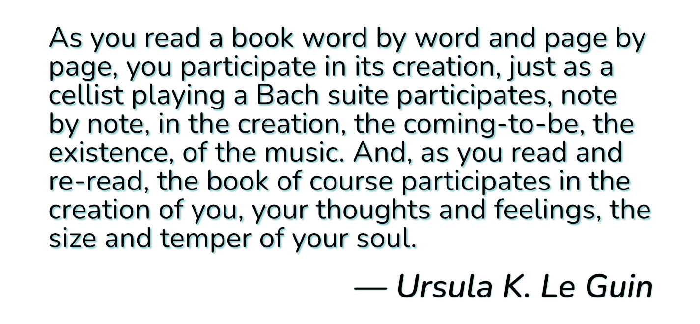
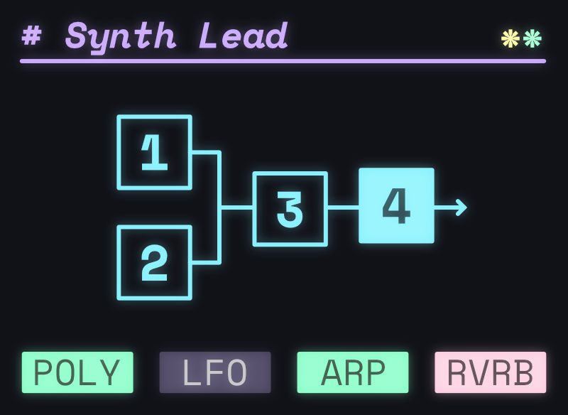
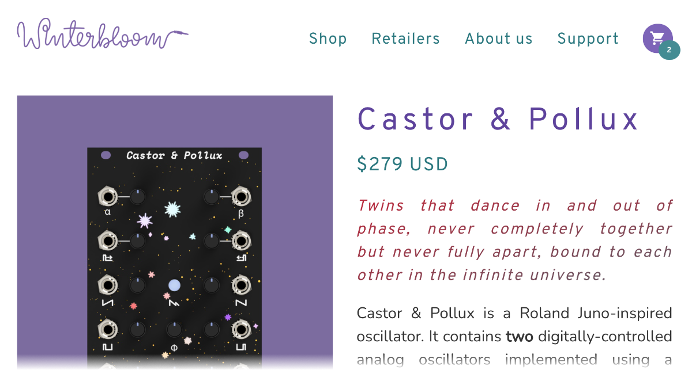
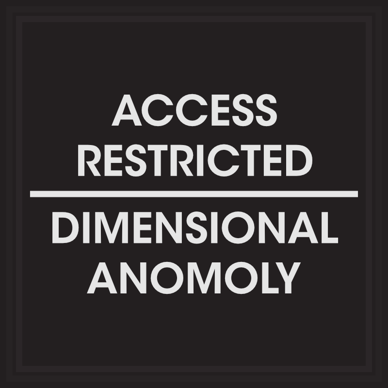
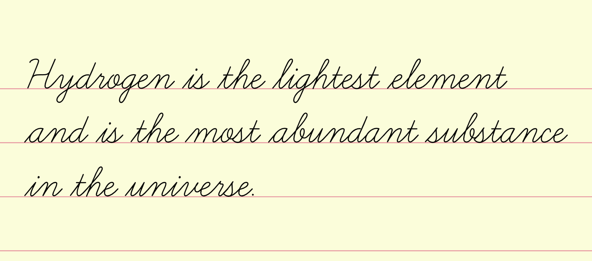
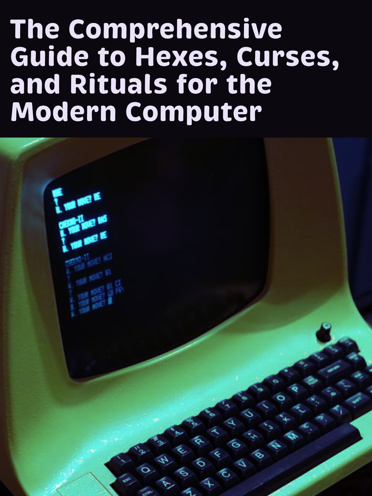

Ah, *typefaces*. They're ubiquitous in our modern, digital world. Digital type has evolved from the early, necessarily simple bitmap fonts of the Commodore 64 and IBM PC to incredibly expressive vector illustrated typefaces we use today. Unless you take the time to journal by hand or you're lucky enough to have someone send you a hand-written letter, you're almost always reading through the lens of a typeface.

Back in the days of handwriting, a person's hand gave way to a unique and personal lettering style. These days we use different typefaces to give our words that layer of context, meaning, intent, and style. The connotations that typefaces carry are so powerful that it's no wonder that people have strong reactions to certain typefaces- [poor Comic Sans](https://en.wikipedia.org/wiki/Comic_Sans#Defense).

As a designer, I try to be very deliberate in the fonts that I use. Picking the right font is just as it's important as picking the right colors, composition, layout, spacing etc. This article talks about a few of the typefaces I use and why I love them.

## Nunito

[*Nunito*](https://fonts.google.com/specimen/Nunito) is a lovely typeface created by [Vernon Adams](http://sansoxygen.com/). I love it for its friendly rounded terminals[^terminals] - it's a serif typeface that doesn't feel overly formal or stuffy. You might notice that this is the font used throughout this blog! While intended to be used as a display typography[^display], I think it works quite well for text especially with the great legibility of the regular, regular italic, and bold styles - perfect for a blog.

Nunito is a free and open source typeface and is available on [Google Fonts](https://fonts.google.com/specimen/Nunito) and the source is available on [GitHub](https://github.com/googlefonts/nunito).

For the serif-averse, there's also [Nunito Sans](https://fonts.google.com/specimen/Nunito+Sans), although I think it loses some of the character of the serif typeface.

[^terminals]: The end of the "stroke" for a character. [read more about the anatomy of a character](https://www.fonts.com/content/learning/fontology/level-1/type-anatomy/anatomy).
[^display]: Which means it's intended for larger uses like headlines, posters, logotypes, etc. - basically, anything but dense body text.

## IBM Plex Mono

[*IBM Plex Mono*](https://www.ibm.com/plex/plexness/#mono-for-coding) is an incredible monospace typeface from IBM and [Bold Monday](https://boldmonday.com/). It is just one of the typefaces in the [IBM Plex superfamily](https://en.wikipedia.org/wiki/IBM_Plex). In my opinion, it's the best member of that family. It's directly inspired by the [IBM Selectric](https://en.wikipedia.org/wiki/IBM_Selectric_typewriter) typewriter which gives it an immediately classic and *physical* quality. The italic style is absolutely gorgeous with just the right amount of slant and its pointed serifs. This is the font I use for my text editor as well as for the embedded code examples in this blog and [Winterbloom's](https://winterbloom.com) documentation.

It might seem strange to feel so fondly of a big scary corporation's typeface, but I believe that IBM has done an incredible job with this typeface and it's free & open source. You can get the font at [Google Fonts](https://fonts.google.com/specimen/IBM+Plex+Mono) and check out the source on [GitHub](https://github.com/IBM/plex/).

## Space Mono

[*Space Mono*](https://www.colophon-foundry.org/custom/spacemono/) is another monospace typeface that I adore. It was created by [Colophon](https://www.colophon-foundry.org/about/) - a UK-based foundry with lots of wonderful typefaces (seriously, go check them out!) What makes Space Mono unique and wonderful is that unlike most monospace fonts, it is not designed for readability - it's a display font made to be used as the center of attention. The creation of Space Mono was [inspired by speculative fiction](https://medium.com/google-design/introducing-space-mono-a-new-monospaced-typeface-by-colophon-foundry-for-google-fonts-84367eac6dfb) and it shows. It evokes the bold, glowing light of a monitor screaming status reports at the crew of a spacecraft. It has a true digital heritage, seperating it from the more physically influenced typefaces like IBM Plex Mono.

In my opinion, the bold, italic font is by far the most evocative. We use this font for the product names on Winterbloom's front panels. A tradition that started with [Castor & Pollux]() and continues as we name our modules with space & sci-fi inspired names.

Space Mono is a free and open source typeface and is available on [Google Fonts](https://fonts.google.com/specimen/Space+Mono) and the source is available on [GitHub](https://github.com/googlefonts/spacemono).

A related and similarly beautiful font with proportional and monspace variants, [Basis](https://www.colophon-foundry.org/typefaces/basis-grotesque/), is available as a commercial typeface.

## Overpass

[*Overpass*](http://overpassfont.org/) is a typeface that is deeply true to its namesake. It was commissioned by Red Hat and designed by [Delve Fonts](https://delvefonts.com/) based on the [lettering used on US highway signs](https://en.wikipedia.org/wiki/Highway_Gothic). Overpass extends the utility of its reference font by optimizing for screen and print use and adding a dozen weights and styles. I love typefaces like this that are deeply rooted in real-world usage and constraints. Because of its origins it has a immediately familiar, official, and legible appearance.

Perhaps surprisingly, this is Winterbloom's primary typeface. It stands in contrast to Winterbloom's playful, squiggly logotype and is displayed in lighter weights and in welcoming hues of purple and teal- effectively subverting the original context of the typeface.

Overpass is a free and open source typeface and is available on [Google Fonts](https://fonts.google.com/specimen/Overpass) and [directly from Red Hat](http://overpassfont.org/). The source is available on [GitHub](https://github.com/RedHatOfficial/Overpass).

By the way, Overpass was commissioned to be a replacement for the commercial [Interstate](https://en.wikipedia.org/wiki/Interstate_(typeface)) typeface designed by [Tobias Frere-Jones](https://frerejones.com/). If you're a big nerd about typefaces used for all manner of public signage, take a look at the [list on Wikipedia](https://en.wikipedia.org/wiki/List_of_public_signage_typefaces).

Honorable mentions: The [National Park](https://nationalparktypeface.com/) typeface that is inspired by the router-cut signs found in US National Parks, and [Colophon's Pantograph](https://www.colophon-foundry.org/typefaces/pantograph/) typeface inspired by its [namesake machine](https://en.wikipedia.org/wiki/Pantograph).

## ITC Avant Garde Gothic

[*ITC Avant Garde Gothic*](https://en.wikipedia.org/wiki/ITC_Avant_Garde) is a typeface originally designed in 1970 by [Herb Lubalin](https://en.wikipedia.org/wiki/Herb_Lubalin) of the [International Typeface Corporation](https://en.wikipedia.org/wiki/International_Typeface_Corporation), one of the first digital typeface foundries. A typeface with 50 years of history has shown up in all sorts of contexts- from the [1971 PBS logo](https://en.wikipedia.org/wiki/File:PBS_1971_id.svg) to the title sequence of Netflix's sci-fi horror [Stranger Things](https://www.youtube.com/watch?v=IuHOAP03V6k). It's an incredibly strong, legible, and bureaucratic-looking typeface that works incredibly well when subverted and used in the context of science fiction and horror. No where is this more apparent than in Remedy's [Control](https://controlgame.com) where it's used to complement the brutalist architecture that belies the paranormal nature of the game's setting, The Oldest House.

ITC Avant Garde Gothic is a commercial typeface and can be purchased from [MyFonts](https://www.myfonts.com/fonts/itc/avant-garde-gothic). If you don't need all of the weights and obliques, [TeX Gyre Adventor](http://www.gust.org.pl/projects/e-foundry/tex-gyre/adventor/index_html) is a free and open-source alternative.

## Learning Curve

[Learning Curve](https://www.bvfonts.com/fonts/details.php?id=76) is a delightful cursive typeface by [Jess Latham](https://www.bvfonts.com/about.php) that's inspired by the cursive handwriting posters and worksheets used by teachers for decades. I love it because of its roots in education- it's clean and legible but not boring. It echoes back to grade school days and has a distinct playful feel. You might recognize it from [*Untitled Goose Game*](https://goose.game/credits/) where it's used for the horrible goose's hand(wing?)-written list of awful things to do.

Learning Curve is a free typeface and you can get it [directly from the designer](https://www.bvfonts.com/fonts/details.php?id=76). Jess Latham has made several of his typefaces freely available but I highly recommend checking out his [paid typefaces](https://www.bvfonts.com/fonts/fonts.php?show=pay) as well. Supporting independent designers is always a good idea.

Also, [Print Clearly](https://www.bvfonts.com/fonts/details.php?id=45) is a complementary print font.

## Brevia

{: style="max-width: 50%" }

[*Brevia*](https://www.hvdfonts.com/fonts/brevia) is a brushed, casual sans serif display typeface by [HvD](https://www.hvdfonts.com/). It's one of my absolute favorites to use for larger, eye-catching typography. It's bold and friendly in the heavier weights. We used this typeface for [PyCascades]() to great effect. While the foundry suggests that Brevia could be used for text, I find it somewhat odd in that context, especially if its used for display in the same design. You could try pairing with [Pluto Sans](https://www.hvdfonts.com/fonts/pluto-sans).

Brevia is a commercial typeface and you can purchase it [directly from HvD](https://www.hvdfonts.com/fonts/brevia).

## More

Not satisfied? Want more cool typefaces? Check out [my thread on Twitter](https://twitter.com/theavalkyrie/status/1396472198437744648) where I asked folks what their personal favorites are. There's lots of wonderful typefaces in that thread!
