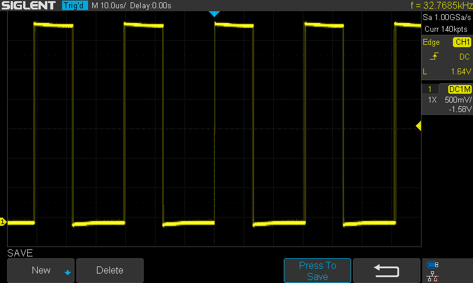

The [Microchip SAM D](https://www.microchip.com/design-centers/32-bit/sam-32-bit-mcus/sam-d-mcus) lineup has a really flexible but sometimes daunting clock system. This post aims to be a gentle introduction to the SAM D21's clock system and a guide for common configurations. It's written as both a *guide* and a *reference* - there is a lot of information here and it's definitely not something that anyone is expected to just absorb with one read. I'm also always open to suggestions and improvements - [open an issue on GitHub](https://github.com/theacodes/blog.thea.codes/issues) and let's chat! Also, while it's written for the SAM D21, this is applicable to most of the chips in the SAM D lineup, including the SAM D11 and SAM D51.


## Clock system overview

The clock system for the SAM D21 has a few concepts that are useful to know about before tackling configuration. There won't be any code examples in this section but sit tight - I'll get into some code very shortly.

First, there are a set of **clock sources**. These are what you generally think of when you think of an "oscillator". Somewhat surprisingly, the clocks sources are configured using the System Controller (`SYSCTRL`) peripheral. The SAM D21 has the following clock sources:

* An 8 MHz internal oscillator (`OSC8M`)
* A 32.768 kHz high-accuracy internal oscillator (`OSC32K`)
* A 32.768 kHz ultra low-power internal oscillator (`OSCULP32K`)
* An internal digital frequency locked loop which can track against other clock sources (`DFLL48M`)
* An internal fractional digital phase-locked loop which can track against other clock sources (`FDPLL96M`)

Second, there is the **Generic Clock Controller (`GCLK`)** peripheral. The general clock peripheral can be seen as a "switchboard" of sorts that allows you to connect *clock sources* to various peripherals. For the SAM D21, there are *eight* generic clocks. Peripherals can be configured to use any of these eight clocks and different peripherals can be clocked from the same generic clock.

For example, if you wanted to clock the `SERCOM0` peripheral from the 8 MHz internal oscillator you would:

1. Enable the 8 MHz oscillator (`OSC8M`) using the `SYSCTRL` peripheral.
2. Configure a generic clock, for example, `GCLK1` to use the `OSC8M` as its clock source.
3. Tell the generic clock multiplexer to connect `GCLK1` to `SERCOM0`.

Finally it's important to know the difference between **synchronous** and **asynchronous** clocks. The main system clock which is used to clock the CPU and the internal busses (AHB/APBx) is called **synchronous**. The generic clocks used to drive peripherals are called **asynchronous**. The reason for this distinction is because it's possible (and common) to drive the peripherals using a different clock source than the CPU. Since there are potentially two different clocks at play, **register synchronization** must sometimes be done. More on that later - trust me, it's much less scary than it sounds.

## Configuring the main (CPU) clock

Let's dive into a concrete example: configuring the main clock and changing the CPU's frequency. The CPU (and the associated busses) are always driven from `GCLK0` (you'll sometimes see this referred to as `GCLK_MAIN`) - so you can kind of think of `GCLK0` as special in that way.

After reset, the SAM D21 runs at 1 MHz. The reason for this is that the default state for the clock system is:

* The 8 MHz internal oscillator (`OSC8M`) is enabled and divided ("prescaled") by 8.
* Generic clock 0 (`GCLK0`) is enabled and uses the 8 MHz internal oscillator as its source.

Since the 8 MHz oscillator is divided by 8, `GCLK0` is generating a 1 MHz clock for the CPU.

This is equivalent to the hardware running this code on startup:

```c
SYSCTRL->OSC8M.bit.PRESC = 0x03;  // divide by 8
SYSCTRL->OSC8M.bit.ENABLE = 1;

GCLK->GENCTRL.reg =
    GCLK_GENCTRL_ID(0) |
    GCLK_GENCTRL_SRC_OSC8M |
    GCLK_GENCTRL_GENEN;
```

A super common thing you'll see across SAM D21 firmware examples is that the first thing the code does is switch the CPU frequency from 1 MHz to 8 MHz. This is easily done by changing the 8 MHz internal oscillator's prescaler:

```c
SYSCTRL->OSC8M.bit.PRESC = 0x0;
```

& that's it! Your SAM D21 is now running as a brisk 8 MHz.

## Running the CPU at 48 MHz

But hold on - the SAM D21 can run at a much much faster 48 MHz! How does that work? Well, this requires quite a lot more configuration and involves the *internal digital frequency locked loop* (`DFLL48M`).

This DFLL took me a long time to wrap my head around. In very basic terms you can think of a frequency locked loop as a *clock multiplier*. Given a reference clock it can multiply that clock's frequency by some given amount - so if you have a 1 MHz reference clock signal going into a DFLL configured to multiply it by 4, you'll get a 4 MHz clock signal.

With that in mind you can hopefully see how the DFLL can generate a 48 MHz clock from a lower frequency reference clock. You have to tell it what clock signal to follow and tell it how much to multiply the rate by.

There are *two* separate, but similar ways to configure the `DFLL48M` to run the CPU at 48 MHz. If you want accuracy you'll use an *external* crystal oscillator as the reference clock and run in *closed loop mode*. Otherwise, you can run in *open loop* mode.

### Using an external crystal and closed-loop mode

The first approach is to use an external 32.768 kHz crystal oscillator as the reference clock. This method requires some external components but allows for the highest accuracy. This is required for a few peripherals - such as running the USB peripheral in host mode. This can look a bit overwhelming but take it one step at a time and you'll get it - I promise.

Before trying to run at a higher CPU clock, you need to configure the *wait states* for the internal flash. This makes sure that the CPU doesn't try to access the flash faster than it can operate. The correct number of wait states for 48 MHz at 3.3v is 1. You can find the wait states for other configurations in Table 37-42 in the [datasheet][datasheet].

```c
/* Set the correct number of wait states for 48 MHz @ 3.3v */
NVMCTRL->CTRLB.bit.RWS = 1;
```

With that done, the next step is to enable the external crystal oscillator:

```c
SYSCTRL->XOSC32K.reg =
    /* Crystal oscillators can take a long time to startup. This
       waits the maximum amount of time (4 seconds). This can be
       reduced depending on your crystal oscillator. */
    SYSCTRL_XOSC32K_STARTUP(0x7) |
    SYSCTRL_XOSC32K_EN32K |
    SYSCTRL_XOSC32K_XTALEN;

/* This has to be a separate write as per datasheet section 17.6.3 */
SYSCTRL->XOSC32K.bit.ENABLE = 1;

/* Wait for the external crystal to be ready */
while(!SYSCTRL->PCLKSR.bit.XOSC32KRDY);
```

With the crystal oscillator setup, the next step is to wire it up the a generic clock. This is so it can be used as the reference for the DFLL. In this case it'll be `GCLK1`, but it can be any clock other than `GCLK0`. It might seem a little strange to go from a clock source (`XOSC32K`, 32.768 kHz) to a generic clock (`GCLK1`) and then back to clock source (`DFLL48M`, 48MHz) and finally to another generic clock (`GCLK0`, 48Mhz), but that's the way it works!

This code sets up `GCLK1` to use `XOSC32K` as the clock source:

```c
/* Configure GCLK1's divider - in this case, no division - so just divide by one */
GCLK->GENDIV.reg =
    GCLK_GENDIV_ID(1) |
    GCLK_GENDIV_DIV(1);

/* Setup GCLK1 using the external 32.768 kHz oscillator */
GCLK->GENCTRL.reg =
    GCLK_GENCTRL_ID(1) |
    GCLK_GENCTRL_SRC_XOSC32K |
    /* Improve the duty cycle. */
    GCLK_GENCTRL_IDC |
    GCLK_GENCTRL_GENEN;

/* Wait for the write to complete */
while(GCLK->STATUS.bit.SYNCBUSY);
```

With `GCLK1` now providing the 32.768 kHz reference clock, the next step is to connect `GCLK1`'s output to the DFLL's reference clock:

```c
GCLK->CLKCTRL.reg =
    GCLK_CLKCTRL_ID_DFLL48 |
    GCLK_CLKCTRL_GEN_GCLK1 |
    GCLK_CLKCTRL_CLKEN;
```

Now that the reference clock is all configured and connected, you can now set up the DFLL. This is described in detail in section 17.6.7.1.2 of the [datasheet][datasheet]. There's a *lot* to wrap your head around here so don't sweat it if it takes a few reads to get it:

```c
/* This works around a quirk in the hardware (errata 1.2.1) -
   the DFLLCTRL register must be manually reset to this value before
   configuration. */
while(!SYSCTRL->PCLKSR.bit.DFLLRDY);
SYSCTRL->DFLLCTRL.reg = SYSCTRL_DFLLCTRL_ENABLE;
while(!SYSCTRL->PCLKSR.bit.DFLLRDY);

/* Set up the multiplier. This tells the DFLL to multiply the 32.768 kHz
   reference clock to 48 MHz */
SYSCTRL->DFLLMUL.reg =
    /* This value is output frequency / reference clock frequency,
       so 48 MHz / 32.768 kHz */
    SYSCTRL_DFLLMUL_MUL(1465) |
    /* The coarse and fine step are used by the DFLL to lock
       on to the target frequency. These are set to half
       of the maximum value. Lower values mean less overshoot,
       whereas higher values typically result in some overshoot but
       faster locking. */
    SYSCTRL_DFLLMUL_FSTEP(511) | // max value: 1023
    SYSCTRL_DFLLMUL_CSTEP(31);  // max value: 63

/* Wait for the write to finish */
while(!SYSCTRL->PCLKSR.bit.DFLLRDY);
```

Before enabling the DFLL, you can set some values to help it initialize faster. When initialized, the DFLL will try to lock on to the the target frequency. It does this by adjusting the `DFLLVAL.COARSE` and `DFLLVAL.FINE` registers. There's a factory calibration value for the coarse register that you should load that'll start the DFLL at a frequency close to 48 MHz and reduce locking time:

```c
uint32_t coarse = (*((uint32_t *)FUSES_DFLL48M_COARSE_CAL_ADDR) & FUSES_DFLL48M_COARSE_CAL_Msk) >> FUSES_DFLL48M_COARSE_CAL_Pos;

SYSCTRL->DFLLVAL.bit.COARSE = coarse;

/* Wait for the write to finish */
while(!SYSCTRL->PCLKSR.bit.DFLLRDY);
```

The final step in setting up the DFLL is to set it to closed loop mode and turn it on:

```c
SYSCTRL->DFLLCTRL.reg |=
    /* Closed loop mode */
    SYSCTRL_DFLLCTRL_MODE |
    /* Wait for the frequency to be locked before outputting the clock */
    SYSCTRL_DFLLCTRL_WAITLOCK |
    /* Enable it */
    SYSCTRL_DFLLCTRL_ENABLE;

/* Wait for the frequency to lock */
while (!SYSCTRL->PCLKSR.bit.DFLLLCKC || !SYSCTRL->PCLKSR.bit.DFLLLCKF) {}
```

Alright, almost done! The final bit is to switch `GCLK0` to use the DFLL instead of the 8 MHz internal oscillator. As soon as this is done the CPU will be running at 48 MHz:

```c
/* Setup GCLK0 using the DFLL @ 48 MHz */
GCLK->GENCTRL.reg =
    GCLK_GENCTRL_ID(0) |
    GCLK_GENCTRL_SRC_DFLL48M |
    /* Improve the duty cycle. */
    GCLK_GENCTRL_IDC |
    GCLK_GENCTRL_GENEN;

/* Wait for the write to complete */
while(GCLK->STATUS.bit.SYNCBUSY);
```

**That's it!** Take a deep breath, that was a lot! To review:

1. Set up `XOSC32K` in `SYSCTRL`.
2. Configure `GCLK1` to use `XOSC32K` as its clock source.
3. Connect `GCLK1` to the DFLL reference clock input.
4. Configure `DFLL48M` to multiply the 32.768 kHz reference to 48 MHz.
5. Configure `GCLK0` to use the `DFLL48M` as its clock source.


### Using open loop mode

If you don't need the accuracy that comes from using an external 32.768 kHz crystal, you can set up the DFLL in *open loop* mode. This means that the DFLL isn't following any specific reference clock, it's just outputting a frequency directly based on its configuration.

As with closed loop mode, you'll need to set up the proper flash wait states:

```c
/* Set the correct number of wait states for 48 MHz @ 3.3v */
NVMCTRL->CTRLB.bit.RWS = 1;
```

With that taken care of, the next step is to load the coarse and fine values for the DFLL from the factory calibration. This will get the DFLL pretty close to 48 MHz:

```c
/* This works around a quirk in the hardware (errata 1.2.1) -
   the DFLLCTRL register must be manually reset to this value before
   configuration. */
while(!SYSCTRL->PCLKSR.bit.DFLLRDY);
SYSCTRL->DFLLCTRL.reg = SYSCTRL_DFLLCTRL_ENABLE;
while(!SYSCTRL->PCLKSR.bit.DFLLRDY);

/* Write the coarse and fine calibration from NVM. */
uint32_t coarse =
    ((*(uint32_t*)FUSES_DFLL48M_COARSE_CAL_ADDR) & FUSES_DFLL48M_COARSE_CAL_Msk) >> FUSES_DFLL48M_COARSE_CAL_Pos;
uint32_t fine =
    ((*(uint32_t*)FUSES_DFLL48M_FINE_CAL_ADDR) & FUSES_DFLL48M_FINE_CAL_Msk) >> FUSES_DFLL48M_FINE_CAL_Pos;

SYSCTRL->DFLLVAL.reg = SYSCTRL_DFLLVAL_COARSE(coarse) | SYSCTRL_DFLLVAL_FINE(fine);

/* Wait for the write to finish. */
while (!SYSCTRL->PCLKSR.bit.DFLLRDY) {};

```

Now you can go ahead and enable the DFLL:

```c
/* Enable the DFLL */
SYSCTRL->DFLLCTRL.bit.ENABLE = 1;

/* Wait for the write to finish */
while (!SYSCTRL->PCLKSR.bit.DFLLRDY) {};
```

Just as with the closed loop example, the final step is to switch `GCLK0` to use the DFLL as its clock source:

```c
/* Setup GCLK0 using the DFLL @ 48 MHz */
GCLK->GENCTRL.reg =
    GCLK_GENCTRL_ID(0) |
    GCLK_GENCTRL_SRC_DFLL48M |
    /* Improve the duty cycle. */
    GCLK_GENCTRL_IDC |
    GCLK_GENCTRL_GENEN;

/* Wait for the write to complete */
while(GCLK->STATUS.bit.SYNCBUSY);
```

### USB clock recovery mode

I know you're thinking "wait- you said there were two ways to configure 48 MHz". Well, that's still true. USB clock recovery mode is a small change to the open loop strategy. USB clock recovery mode (detailed in section 17.6.7.2.2 of the [datasheet][datasheet]) is a neat way of generating a 48 MHz clock from the USB connection. If the SAM D21 is used as a USB device then the DFLL can be configured to use the 1 kHz USB start-of-frame as the reference clock. This is actually *required* if you don't have an external crystal and you want to operate as a USB device. It's a neat feature that allows for some cost saving when designing hardware.

The way to set this up is to take the open loop configuration as a starting point:

```c
/* Set the correct number of wait states for 48 MHz @ 3.3v */
NVMCTRL->CTRLB.bit.RWS = 1;

/* This works around a quirk in the hardware (errata 1.2.1) -
   the DFLLCTRL register must be manually reset to this value before
   configuration. */
while(!SYSCTRL->PCLKSR.bit.DFLLRDY);
SYSCTRL->DFLLCTRL.reg = SYSCTRL_DFLLCTRL_ENABLE;
while(!SYSCTRL->PCLKSR.bit.DFLLRDY);

/* Write the coarse and fine calibration from NVM. */
uint32_t coarse =
    ((*(uint32_t*)FUSES_DFLL48M_COARSE_CAL_ADDR) & FUSES_DFLL48M_COARSE_CAL_Msk) >> FUSES_DFLL48M_COARSE_CAL_Pos;
uint32_t fine =
    ((*(uint32_t*)FUSES_DFLL48M_FINE_CAL_ADDR) & FUSES_DFLL48M_FINE_CAL_Msk) >> FUSES_DFLL48M_FINE_CAL_Pos;

SYSCTRL->DFLLVAL.reg = SYSCTRL_DFLLVAL_COARSE(coarse) | SYSCTRL_DFLLVAL_FINE(fine);

/* Wait for the write to finish. */
while (!SYSCTRL->PCLKSR.bit.DFLLRDY) {};
```

Next, configure the settings to enable USB clock recovery mode:

```c
SYSCTRL->DFLLCTRL.reg |=
    /* Enable USB clock recovery mode */
    SYSCTRL_DFLLCTRL_USBCRM |
    /* Disable chill cycle as per datasheet to speed up locking.
       This is specified in section 17.6.7.2.2, and chill cycles
       are described in section 17.6.7.2.1. */
    SYSCTRL_DFLLCTRL_CCDIS;

/* Configure the DFLL to multiply the 1 kHz clock to 48 MHz */
SYSCTRL->DFLLMUL.reg =
    /* This value is output frequency / reference clock frequency,
       so 48 MHz / 1 kHz */
    SYSCTRL_DFLLMUL_MUL(48000) |
    /* The coarse and fine values can be set to their minimum
       since coarse is fixed in USB clock recovery mode and
       fine should lock on quickly. */
    SYSCTRL_DFLLMUL_FSTEP(1) |
    SYSCTRL_DFLLMUL_CSTEP(1);
```

Then set the DFLL into closed loop mode and enable it:

```c
/* Closed loop mode */
SYSCTRL->DFLLCTRL.bit.MODE = 1;

/* Enable the DFLL */
SYSCTRL->DFLLCTRL.bit.ENABLE = 1;

/* Wait for the write to complete */
while (!SYSCTRL->PCLKSR.bit.DFLLRDY) {};
```

This can be a little confusing but here's what happens:

* If there isn't a USB connection then things work just as they did in open loop mode. The DFLL outputs a clock *close* to 48 MHz and does not have a reference clock.
* When there is a USB connection then things work similar to the way they did in closed loop mode. The DFLL follows the 1 kHz USB start of frame message and outputs a much more accurate 48 MHz clock.

After setting all of this up the final step is again to tell `GCLK0` to use the DFLL as its clock source:

```c
/* Setup GCLK0 using the DFLL @ 48 MHz */
GCLK->GENCTRL.reg =
    GCLK_GENCTRL_ID(0) |
    GCLK_GENCTRL_SRC_DFLL48M |
    /* Improve the duty cycle. */
    GCLK_GENCTRL_IDC |
    GCLK_GENCTRL_GENEN;

/* Wait for the write to complete */
while(GCLK->STATUS.bit.SYNCBUSY) {};
```

## Peripheral clocks

Alright, now that you're a master of the synchronous main clock let's talk about peripheral clocks. Each of the SAM D21's peripherals deal with two different clock domains:

1. The **peripheral interface** clock: this is the *synchronous* clock from the CPU & associated busses (AHB/APBx).
2. The **peripheral core** clock: this is the *asynchronous* clock that's configured and wired up to the peripheral using the `GCLK` peripheral.

The first one you've already set up - it's the CPU clock. It comes into play in a bit in the *register synchronization* section. The second - the *peripheral core* clock is what this section covers.

To enable a peripheral that needs a clock, you'll need to:

1. Set up a generic clock generator (`GCLK`) using one of the clock sources. Remember that multiple peripherals can share the same `GCLK`, and you can use `GCLK0` to clock peripherals as well.
2. Configure the generic clock multiplexer to connect the `GCLK` to the peripheral.
3. Enable the peripheral's interface clock using the power management (`PM`) peripheral.

Here's a concrete example: let's configure the clock for `SERCOM0`.

The first step is to setup a generic clock generator. You could use `GCLK0`, but I commonly use a generic clock that uses the 8 MHz oscillator as a clock source for `SERCOM` peripherals. So this configures `GCLK2` to use the 8 MHz oscillator:

```c
/* Configure GCLK2's divider - in this case, no division - so just divide by one */
GCLK->GENDIV.reg =
    GCLK_GENDIV_ID(2) |
    GCLK_GENDIV_DIV(1);

/* Setup GCLK2 using the internal 8 MHz oscillator */
GCLK->GENCTRL.reg =
    GCLK_GENCTRL_ID(2) |
    GCLK_GENCTRL_SRC_OSC8M |
    /* Improve the duty cycle. */
    GCLK_GENCTRL_IDC |
    GCLK_GENCTRL_GENEN;

/* Wait for the write to complete */
while(GCLK->STATUS.bit.SYNCBUSY) {};
```

The second step is to tell the clock multiplexer to connect `GCLK2` to `SERCOM0`:

```c
/* Connect GCLK2 to SERCOM0 */
GCLK->CLKCTRL.reg =
    GCLK_CLKCTRL_CLKEN |
    GCLK_CLKCTRL_GEN_GCLK2 |
    GCLK_CLKCTRL_ID_SERCOM0_CORE;

/* Wait for the write to complete. */
while (GCLK->STATUS.bit.SYNCBUSY) {};
```

Finally enable the peripheral interface clock using the power management peripheral:

```c
PM->APBCMASK.reg |= PM_APBCMASK_SERCOM0;
```

At this point the peripheral is ready to use! You can software reset the peripheral and start configuring it as needed:

```c
SERCOM0->SPI.CTRLA.bit.SWRST = 1;
while (SERCOM0->SPI.SYNCBUSY.bit.SWRST) {};

...
```

## Register synchronization

You might have noticed that there are a lot of references to `SYNCBUSY` above. This is a consequence of *register synchronization*. This is needed because there's two clocks at play when interacting with a peripheral - one clock for the CPU and the busses and a generic clock that's running the peripheral core. A direct example is that the configuration above runs the CPU at 48 MHz and `SERCOM0` at 8 MHz. Since the core is accessing the same registers as the CPU, some writes and reads need to be synchronized.

When reading the [datasheet's][datasheet] register descriptions for a peripheral you'll see the term *"Write-Synchronized"*. This means that when you write to this register the hardware will set the peripheral's `SYNCBUSY` register while synchronizing the write. For example:

```c
/* Enable SERCOM0 */
SERCOM0->SPI.CTRLA.bit.ENABLE = 1;

/* Wait for the write to complete before modifying any other SERCOM0 registers */
while (SERCOM0->SPI.SYNCBUSY.bit.ENABLE) {};
```

If you try to write to a peripheral's register while it's busy synchronizing, the CPU will stall until the synchronization is complete.

You can read more about register synchronization in section 14.3 of the [datasheet][datasheet].

## Debugging clocks with an oscilloscope

If you have access to an oscilloscope you can take advantage of a nice feature of the SAM D chips: outputting a generic clock (`GCLK`) to an I/O pin. This is super useful when you're trying to verify that all of your clocks are working correctly. When debugging this way I *highly* recommend that you don't mess with `GCLK0` at all so that you don't have to worry about a bad configuration breaking the CPU clock.

To enable clock output you need to set the `OE` bit when configuring a generic clock through `GCLK->GENCTRL`. For example, this configures `GCLK1` and enables I/O output:

```c
GCLK->GENCTRL.reg =
    GCLK_GENCTRL_ID(1) |
    GCLK_GENCTRL_SRC_XOSC32K |
    GCLK_GENCTRL_IDC |
    GCLK_GENCTRL_GENEN |
    /* Enable outputting the clock to an I/O pin. */
    GCLK_GENCTRL_OE;

/* Wait for the write to complete */
while(GCLK->STATUS.bit.SYNCBUSY);
```

Once that's configured you'll need to configure the port multiplexer to connect the `GCLK` output to a pin. For example, this sets up `PA15` to output `GCLK1`:

```c
PORT->Group[0].DIRSET.reg = (1 << 15);
PORT->Group[0].PINCFG[15].reg |= PORT_PINCFG_PMUXEN;
PORT->Group[0].PMUX[15 >> 1].bit.PMUXO |= PORT_PMUX_PMUXO_H;
```

> Note that for even-numbered pins you'll need to use `PORT_PMUX_PMUXE_H`, for example, for `PA10` you'd use `PORT->Group[PORTA].PMUX[11 >> 1].reg |= PORT_PMUX_PMUXE_H;`.

With that complete you can connect an oscilloscope to `PA15` and observe the clock:



Like many other I/O peripherals there's only a certain set of pins you can use for this. This is covered in detail in the port multiplexing section of the [datasheet][datasheet], but here's a handy table for the SAM D21:

| GCLK | I/O Pins | Mux |
| --- | --- | --- |
| GCLK0 | PA14, PB14, PB22, PA27, PA28, PA30 | H |
| GCLK1 | PA15, PB15, PB23 | H |
| GCLK2 | PA16, PB16 | H |
| GCLK3 | PA17, PB17 | H |
| GCLK4 | PA10, PB10, PA20 | H |
| GCLK5 | PA11, PB11, PA21 | H |
| GCLK6 | PA12, PA22 | H |
| GCLK7 | PB13, PA23 | H |

## Some tips and miscellanea

* Failing to unmask the the peripheral in the power management (`PM`) peripheral and trying to access any peripheral registers will lock the CPU.
* Synchronization stalls aren't usually that big of a deal, but explicitly handling them makes sure that interrupts will be properly serviced while waiting for synchronization.
* It might seem odd that there are *three* different options for a 32.768 kHz oscillator. This mystery is solved by consulting the *electrical characteristics* section of the datasheet (section 37.13). Using an external crystal (`XOSC32K`) will give a *very* accurate frequency of 32.768 kHz with about 100ppm of drift, but it'll consume around 2.19 μA. `OSC32K` has a frequency between 32.276 - 33.260 kHz and consumes at most 1.31 μA. Finally, `OSCULP32K` has a frequency between 31.293 - 34.570 kHz and consumes at most 125 nA. It basically comes down to a tradeoff between accuracy and power consumption. In many cases you can use the ultra low power internal oscillator (`OSCULP32K`) and save a lot on power consumption.
* The DFLL48M in open loop mode will output a frequency between 47 MHz - 49 MHz as long as you load the factory coarse calibration value. In closed loop mode with an external crystal oscillator it'll be between 47.963 MHz - 47.981 MHz.
* Pay close attention to the peripheral clock requirements. For example, the ADC peripheral can only capture samples up to 350 kHz (datasheet table 37-6). Also note that some peripherals can have a high frequency clock input but they must configure their peripheral clock divider to be lower - for example, the ADC peripheral can have an input clock of up to 48MHz but can only run its peripheral clock at up to 2.1 MHz (datasheet table 37-24), so you would have to configure `ADC->CTRLB.bit.PRESCALER` appropriately.

## References and further reading

* [Microchip Developer - SAM D21 Clock Configuration](https://microchipdeveloper.com/32arm:samd21-clock-system-configuration)
* [CircuitPython's clock initialization](https://github.com/adafruit/samd-peripherals/blob/6b531fc923d9f02b14bd731a5f584ddf716e8773/samd/samd21/clocks.c)
* [Datasheet][datasheet]
* [Errata][errata]

[datasheet]: https://ww1.microchip.com/downloads/en/DeviceDoc/SAM_D21_DA1_Family_DataSheet_DS40001882F.pdf
[errata]: http://ww1.microchip.com/downloads/en/DeviceDoc/SAM-D21-Family-Silicon-Errata-and-DataSheet-Clarification-DS80000760D.pdf
